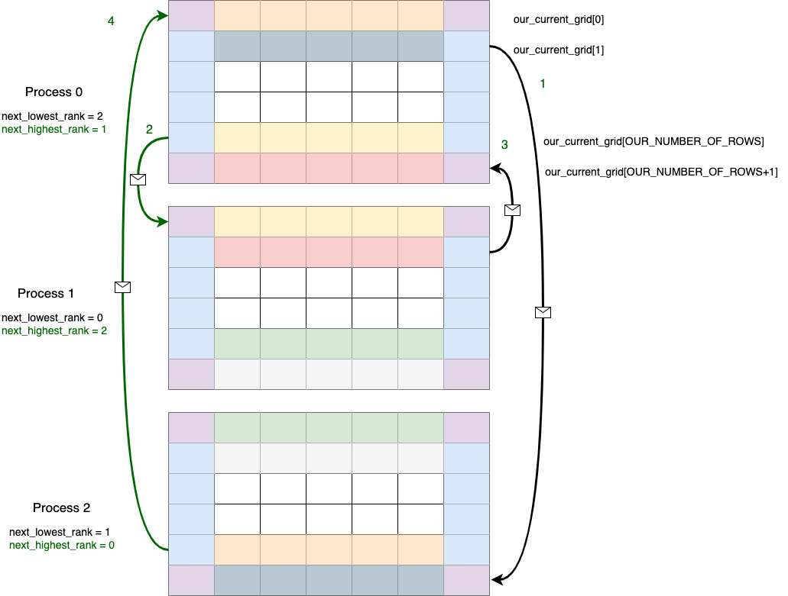

# Parallelization: Conway's Game of Life

Originally written by Aaron Weeden, Shodor Education Foundation, Inc.

Revised by Libby Shoop, Macalester College, for COMP 445

## Abstract

This module teaches: 1) Conway's Game of Life as an example of a cellular automaton, 2) how cellular automata are used in solutions to scientific problems, 3) how to implement parallel code for Conway's Game of Life  4) how to measure the performance and scaling of a parallel application in multicore and manycore environments, and 5) how cellular automata fall into the Structured Grid computational pattern (a class of algorithms that have similar communication and computation patterns).

<!--
(including versions that use shared memory via OpenMP, distributed memory via the Message Passing Interface (MPI), and hybrid via a combination of OpenMP and MPI),
-->

Upon completion of this module, students should be able to: 1) Understand the importance of cellular automata in modeling scientific problems, 2) Design a parallel algorithm and implement it using MPI, 3) Measure the scalability of a parallel code over multiple cores, and 4) Explain the communication and computation patterns of the Structured Grid parallel computational pattern.

## A note about your tasks

In this assignment there are questions along the way as the problem and the solution is described. Some are labeled **TO DO** and others are labeled **Questions for review**. These are designed to make you stop a moment and think about what is being presented. Some of what you do for these can end up in your report, some might not.

What you should ultimately do is the following:

1. Review the code, both sequential and most of an MPI solution provided, while reading the description of the algorithm and solution below.
2. Make the changes required for the MPI version to make it work properly and so that the main loop of iterations is timed.
3. Devise some **weak scalability experiments** for the MPI version with varying grid size, keeping the number of iterations constant.
4. Write a report on your Google Drive space describing your results.

Details of some of these tasks are found in this document, which does contain a great deal of detail, in an effort to make the problem understandable.


## Conway's Game of Life and cellular automata: Motivation and Introduction

The cellular automaton is an important tool in science that can be used to model a variety of natural phenomena. Cellular automata can be used to simulate brain tumor growth by generating a 3-dimensional map of the brain and advancing cellular growth over time [1]. In ecology, cellular automata can be used to model the interactions of species competing for environmental resources [2]. These are just two examples of the many applications of cellular automata in many fields of science, including biology [3][4], ecology [5], cognitive science [6], hydrodynamics [7], dermatology [8], chemistry [9][10], environmental science [11], agriculture [12], operational research [13], and many others.

Cellular automata are so named because they perform functions automatically on a grid of individual units called cells. These types of algorithms make up the computational pattern called *Structured Grids* along the left side of the parallel patterns diagram supplied for this course. Another hallmark of these computations is that computations are performed in a series of steps, where in each step the cells are updated based on the state of the neighborhood of cells around them. The neighborhood of cells used is called a **stencil**, and can vary between and within applications.

**TO DO:**

1. Find Structured Grid on the parallel patterns diagram along the left as a computational pattern. This type of code that you are studying here is well used in scientific programming and can have very good parallel solutions.
2. In the link to the [Berkeley patterns page](https://patterns.eecs.berkeley.edu/?page_id=498), find the definition of a stencil. Note how this is applied in the code as it is described later below.

One of the most significant and important examples of the cellular automaton is John Conway's Game of Life, which first appeared in [15]. Conway wanted to design his automaton such that emergent behavior would occur, in which patterns that are created initially grow and evolve into other, usually unexpected, patterns. He also wanted to ensure that individual patterns within the automaton could dissipate, stabilize, or oscillate. Conway's automaton is capable of producing patterns that can move across the grid (gliders or spaceships), oscillate in place (flip-flops), stand motionless on the grid (still lifes), and generate other patterns (guns).

Conway established four simple rules that describe the behavior of cells in the grid. At each time step, every cell in the grid has one of two particular states: ALIVE or DEAD. The rules of the automaton govern what the state of a cell will be in the next time step.

Like all cellular automata, the rules in Conway's Game of Life pertain to cells and their "neighbors", or the cells to which a cell is somehow related (usually spatially). The collection of a cell's neighbors is known as the cell's "neighborhood". Two examples of neighborhoods are shown in Figure 1. The code in this module uses the latter of these two, the "Moore neighborhood", in which the 8 cells immediately adjacent to a cell constitute the cell's neighbors.


**Figure 1: Two types of neighborhoods of a black cell, consisting of red neighbor cells: von Neumann neighborhood (left) and Moore neighborhood (right).**

An issue arises for the cells on the edges of the grid, since they will not have a full neighborhood. Cells on the sides only have 5 neighbors, and those in the corners only have 3 neighbors. There are numerous ways to solve this problem. In this module, we resolve the issue by modeling the grid not as a rectangle, but as a torus that wraps around on the top, bottom, and sides. In this arrangement, the cells in the top row have the cells in the bottom row as their neighbors to the north, the cells in the bottom row have those in the top row as their neighbors to the south, the cells in the left column have the cells in the right column as their neighbors to the west, and the cells in the right column have the cells in the left column as their neighbors to the east. A toroidal grid can be simplified by including "ghost" rows and columns, which are copies of the rows and columns on the opposite sides of the grid from the edge rows and columns. A ghost corner is determined by copying the corner cell that is opposite the ghost corner on the diagonal. The method of using ghost rows and columns is depicted in Figure 2.


**Figure 2: A toroidal grid simplified with ghost rows and columns**

## The Rules

The rules of Conway's Game of Life are as follows:

- If a cell has fewer than 2 ALIVE neighbors, it will be DEAD in the next time step.
- If an ALIVE cell has 2 or 3 ALIVE neighbors, it will be ALIVE in the next time step.
- If a cell has more than 3 ALIVE neighbors, it will be DEAD in the next time step.
- If a DEAD cell has 3 ALIVE neighbors, it will be ALIVE in the next time step.

The automaton begins by initializing the states of the cells randomly and ends after a certain number of 'time steps' have elapsed.

For a small board, a cellular automaton can be simulated with pencil and paper. For even a reasonably small board, however, working by hand becomes cumbersome and the use of a computer is needed to run the simulation in an acceptable amount of time. A coded implementation of Conway's Game of Life running on a single computer can simulate a fairly large grid in a very small amount of time.

To simulate an even bigger grid, one needs to employ more processing power than is available on a single processor. The concept of parallel processing can be used to leverage the computational power of computing architectures with multiple or many processors working together.

Conway's Game of Life is an interesting problem to parallelize because of the boundary conditions involving ghost rows and columns and because neighbor cells are tightly-coupled; that is, neighbors relate to each other directly and require calculations to be performed on groups of them. This leads to interesting parallel communication patterns and requires a modest amount of computation as well.

**Quick Review Questions:**

1. What determines the state of a cell in a given time step?
2. What is the purpose of having "ghost" rows and columns?


## The sequential, or 'serial' algorithm

The steps of the basic algorithm are as follows:

1. Parse command line arguments (rows, columns, time steps)
2. Make sure we have enough rows, columns, and time steps
3. Exit if we don't
4. Allocate enough space in our current grid and next grid for the number of rows and the number of columns, plus the ghost rows and columns
5. Initialize the grid (each cell gets a random state)
6.  Run the simulation for the specified number of time steps
    1.  Set up the ghost rows
    2.  set up the ghost columns
    3.  Display grid if debugging flag SHOW_RESULTS is set in Makefile
    4.  Determine the values for the next grid: for each row and column:
        1.  Initialize the count of ALIVE neighbors to 0
        2.  For each row of the cell's neighbors (above, below) and for each column of the cell's neighbors (left, right):
            1.  If the neighbor is not the cell itself, and the neighbor is ALIVE, Add 1 to the count of the number of ALIVE neighbors
        3.  Apply rules 1 - 4 of Conway's game of life
    5.  copy the next grid into the current grid
7. Deallocate data before returning
   
Look at the code file `life_seq.c` to see these steps commented in main().

Note that we have also added timing of the code to this version.

## Try the serial version

Build the serial version like this:

    make serial

Run it like this:

    ./life.serial -r 10 -c 10 -t 10

Note: There is currently a flag in the Makefile that enables printing of the grid. Now that you see that it is working, you could **comment out this line by placing a # in front of it**:

    CFLAGS+=-DSHOW_RESULTS

Then make clean and make serial again and run a larger sized grid. Try something like this:

    ./life.serial -r 1000 -c 1000 -t 100

## Before going on to the parallel version

**Remove this comment line by removing # in front of it**:

    #CFLAGS+=-DSHOW_RESULTS

---
## What is a problem size?

Note that this algorithm has three values that help us determine a "problem size":

- The number of rows in the grid
- The number of columns in the grid
- The number of time steps
  
This can make it quite a bit trickier to set up experiments and determine speedup in the traditional way that we did it for the first homework and for the OpenMP trapezoidal rule integration example.

For this case, it will be best to fix the number of time steps and vary the size of the grid for your experiments. This isn't always what we might want to do for cellular automata that model physical phenomena, where increasing the number of time steps often enables more accurate results.

---

    

## Motivation for Parallelism

There are compelling advantages for using parallelism. The three motivations considered in this module are speedup, accuracy, and scaling.

"Speedup" is the idea that a program will run faster if it is parallelized as opposed to executed serially. The advantage of speedup is that it allows a problem to be modeled faster. If multiple execution flows are able to work at the same time, the work will be finished in less time than it would take a single execution flow. Speedup is an enticing advantage.

 It should be emphasized that this module refers to “modeling” a problem, not “solving” a problem.   This follows the computational science credo that algorithms running on computers are just one tool used to develop approximate solutions (models) to a problem.  Finding an actual solution may involve the use of many other models and tools.

"Accuracy" is the idea of forming a better solution to a problem. If more processes are assigned to a task, they can spend more time doing error checks or other forms of diagnostics to ensure that the final result is a better approximation of the problem that is being modeled. In order to make a program more accurate, speedup may need to be sacrificed.

"Scaling" is perhaps the most promising of the three motivations. Scaling is the concept that more parallel processors can be used to model a bigger problem in the same amount of time it would take fewer parallel processors to model a smaller problem. 

There are issues that limit the advantages of parallelism; we will address two in particular. The first, communication overhead, refers to the time that is lost waiting for communications to take place before and after calculations. During this time, valuable data is being communicated, but no progress is being made on executing the algorithm. The communication overhead of a program can quickly overwhelm the total time spent modeling the problem, sometimes even to the point of making the program less efficient than its serial counterpart. Communication overhead can thus mitigate the advantages of parallelism.

A second issue is described in an observation put forth by Gene Amdahl and is commonly referred to as "Amdahl's Law". Amdahl's Law says that the speedup of a parallel program will be limited by its serial regions, or the parts of the algorithm that cannot be executed in parallel. Amdahl's Law posits that as the number of processors devoted to the problem increases, the advantages of parallelism diminish as the serial regions become the only part of the code that takes significant time to execute. 

**TO DO:**
1. Review the discussion of Ahmdahl's 'law' in section 2.6.2 of your book, which also mentions Gustafson's more mathematical 'law', described below.

Amdahl's Law provides a strong and fundamental argument against utilizing parallel processing to achieve speedup. However, it does not provide a strong argument against using it to achieve accuracy or scaling. The latter of these is particularly promising, as it allows for bigger classes of problems to be modeled as more processors become available to the program. The advantages of parallelism for scaling are summarized by John Gustafson in Gustafson's Law, which says that bigger problems can be modeled in the same amount of time as smaller problems if the processor count is increased. Gustafson's Law is represented as an equation:

Speedup(N) = N – (1 – P) \* (N – 1)

where

N = the number of processors

(1 – P) = the proportion of the program that cannot be made parallel


Amdahl's Law reveals the limitations of what is known as "strong scaling", in which the number of processes remains constant as the problem size increases. Gustafson's Law reveals the promise of "weak scaling", in which the number of processes increases along with the problem size. This exercise you will undertake is to discover the promnise of Gustafson's law and weak scalability.


**Quick Review Questions:**

1. What is the difference between using parallelism for speedup versus using it for scaling?
2. What is Amdahl's Law? What is Gustafson's Law?
3. What is the difference between "strong scaling" and "weak scaling"?
   
## Definitions for a parallel program version using MPI

In parallel processing, instead of a single program executing tasks in a sequence, the program is split among multiple "execution flows" executing tasks in parallel, i.e. at the same time. The term "execution flow" refers to a discrete computational entity that performs processes autonomously. A common synonym is “execution context”; “flow” is chosen here because it evokes the stream of instructions that each entity processes.

Execution flows have more specific names depending on the flavor of parallelism being utilized. In "distributed memory" parallelism, in which execution flows keep their own private memories (separate from the memories of other execution flows), execution flows are known as "processes". In order for one process to access the memory of another process, the data must be communicated, commonly by a technique known as "message passing". The standard of message passing considered in this module is defined by the "Message Passing Interface (MPI)", which defines a set of primitives for packaging up data and sending them between processes.

## Development of the parallel algorithm

A good first step of parallel development is to identify the goal of the algorithm and to clearly state what it is trying to accomplish. We define the Game of Life algorithm as follows, "A grid of cells is updated at each time step for some number of time steps based on the rules of Conway's Game of Life."

In this description and from the sequential version, we can see some of the data structures that we need by finding the nouns (and the adjectives and prepositional phrases associated with them) in our description and matching them up to the existing sequential code. An example of a list of data structures is shown in Table 1.

| **Noun** | **Data structure** |variable names|
| --- | --- |---|
| _a grid of cells_ | A 2-dimensional array of _cells_ | our_current_grid, NUMBER_OF_ROWS, NUMBER_OF_COLUMNS|
| _cell_ | An integer representing a state (ALIVE or DEAD) |our_current_row, my_current_column|
| _each time step_ | An integer count of the number of time steps that have elapsed |current_time_step|
| _some number of time steps_ | An integer representing the total number of time steps |NUMBER_OF_TIME_STEPS|
| _ALIVE neighbors_ | An integer count of the number of ALIVE neighbors |my_number_of_alive_neighbors|
| _the next time step_ | A 2-dimensional array of _cells_ representing the grid in the next time step |our_next_grid|

**Table 1: Data structures needed and variable names from sequential code**

Notice that we keep an integer count of the number of time steps. We could also keep a separate grid for each time step, but in order to save memory we choose to only keep the two grids that are most important: the current grid and the next grid (we need to keep at least two grids because we do not want to overwrite the cells in one grid before we have referenced them all to determine the cells of the new grid).

There are extra pieces of data that enable the parallelism in MPI. Any parallel algorithm is likely to have data values like the ones called OUR_RANK and NUMBER_OF_PROCESSES listed in Table 2. In addition, for this particular structured grid cellular automata algorithm, we will use the additional two data values listed in Table 2. These are explained further below.


| **Written Representation** | **Name** |
|----|----|
| The rank of a process | OUR\_RANK |
| The number of processes | NUMBER\_OF\_PROCESSES |
| neighbor process with subgrid 'above' us|next_lowest_rank|
|neighbor process with subgrid 'below' us|next_highest_rank|
|||


**Table 2: Data structures that control parallelism**

Note:

-  “Rank” is the terminology used by MPI to indicate the ID number of a process.

The next question to ask is, "Where does data parallelism occur?" Recall that the data decompostition parallel pattern refers to splitting up data among all the execution flows. 

To start, we identify the data that will be split among the processes and upon which the processes will perform a task in parallel. Of the data structures in Table 1, only two have data that can be parallelized: the 2-dimensional array of cells representing the grid in the current time step and the 2-dimensional array of cells representing the grid in the next time step. A grid is 2-dimensional because it consists of rows and columns, so the grid can be split into chunks of rows, chunks of columns, sub-grids, or various other configurations. In this module, **we choose to split the grid into chunks of rows.**

We must now ask, "For how many rows is each process responsible?" There are many ways to determine a process's "workload", or the amount of data for which it is responsible. One common method is to have a single process assign data to the other processes (so-called "conductor/worker" methods). In this module, we instead choose to have each process determine its own workload. This will be done by having each process be resposible for creating a smaller subgrid of the entire grid that has the same number of columns and this many rows:

```C
OUR_NUMBER_OF_ROWS = NUMBER_OF_ROWS / NUMBER_OF_PROCESSES
```

If the number of rows is not exactly divisible by the number of processes, we let the last process  take the remainder, like this:

```C
if (OUR_RANK == NUMBER_OF_PROCESSES - 1) {
        OUR_NUMBER_OF_ROWS += NUMBER_OF_ROWS % NUMBER_OF_PROCESSES;
}
```

Now that we have determined how the data is parallelized, the next question to ask is, "what parallel task is performed on the data"? Each process has some number of rows (hereafter referred to as a sub-grid) for which it is responsible to find the state of the cells in the next sub-grid. For each cell in the sub-grid, the state of the neighbor cells must be determined, and from this information the state of the cell in the new sub-grid is set.

The next question is, "What additional values must be established in order to perform this parallel task?" A good method for identifying these is to draw and label a picture of the task. An example of such a picture is in Figure 3, using 4 processes. Things labeled "I, me, and my" refer to the set of tasks a process will carry out. Things labeled "we, us, and our" refer to the processes that will run in parallel.


**Figure 3: A picture of the parallel task at hand**

From Figure 3, we can see that the process needs to use ghost rows of parts of the grids above and below it that other processes are computing. How is it able to access these rows? It must receive them from the other processes.

Recall that processes communicate data to each other by passing messages. The processes must pass ghost rows to other processes that need to access them and they mus receive ghost rows from other processes. To better understand this, it is again helpful to draw a picture. Figure 4 shows an example of such a picture, with 3 processes and 5 x 4 grids of data with their ghost rows and columns surrounding them.



**Figure 4: Message passing that Process 0 is involved in**

The sends labeled 1 and 2 correspond to the sections labeled 10.1.1 and 10.1.2 with comments in the code. The receives labeled 3 and 4 correspond to the sections labeled 10.1.3 and 10.1.4 with comments in the code. 10.1.1 is given to you and you will need to complete 10.1.2-4.

It should be noted that each process now will have two ghost rows in addition to the rows it was assigned. We can work this into our data structures by making the first row the top ghost row and the last row the bottom ghost row.

The order of sends and receives is relevant. The MPI calls we use in this module send messages using "non-blocking" methods but receive them using "blocking" methods. The distinction between these is that blocking methods stop the execution of the program until an event occurs, whereas non-blocking methods allow the program to continue regardless. This means that messages must be ready to be received if the program is to continue, which only works if the messages are sent first. MPI also offers methods for blocking sends and non-blocking receives, but these will be not discussed in this module.

We can now return to Figure 3. Recall that we are trying to identify the new values that are needed to execute the parallel task. We can see from Figure 3 that certain questions are being asked; these can be answered by creating new values. Table 3 shows an example of this.


| **Written Representation** | **Name** |
| --- | --- |
| Our Current Grid | our\_current\_grid[][] |
| Our Next Grid | our\_next\_grid[][] |
| On which row are we working? | our\_current\_row |
| At which neighbor row am I looking? | my\_neighbor\_row |
| On which column am I working? | my\_current\_column |
| At which neighbor column am I looking? | my\_neighbor\_column |
| For the cell on which I am working, how many ALIVE neighbors have I seen so far? | my\_number\_of\_alive\_neighbors |
|||

**Table 3: Written representation of values needed for the parallel version**


---

Below is the parallel MPI algorithm, written in pseudocode.

All processes do the following steps. Those labeled with (MPI) are needed for the message-passing version. Thise labeled with[TODO] are parts of the code provided to you in the file `life_mpi.c` that you will complete.

0. Initialize the distributed memory environment  (MPI)
1. Parse command line arguments (rows, columns, time steps)
2. Make sure we have enough rows, columns, and time steps
3. Exit if we don't
4. Start timing, using a barrier  [TODO]
5. Determine our number of rows (MPI)
6. Allocate enough space in our current grid and next grid for the number of rows and the number of columns, plus the ghost rows and columns
7. Initialize the grid (each cell gets a random state)
8.  Determine the process with the next-lowest rank (MPI)
9.  Determine the process with the next-highest rank (MPI)
10. Run the simulation for the specified number of time steps
    1.  Set up the ghost rows (MPI)
        1. Send our second-from-the-top row to the process with the next-lowest rank (MPI)
        2. Send our second-from-the-bottom row to the process with the next-highest rank (MPI) [TODO]
        3. Receive our bottom row from the process with the next-highest rank (MPI) [TODO]
        4. Receive our top row from the process with the next-lowest rank (MPI) [TODO]
    2.  set up the ghost columns
    3.  Display grid if debugging flag SHOW_RESULTS is set in Makefile; only process 0 does the printing. (MPI)
    4.  Determine the values for the next grid: for each row and column:
        1.  Initialize the count of ALIVE neighbors to 0
        2.  For each row of the cell's neighbors (above, below) and for each column of the cell's neighbors (left, right):
            1.  If the neighbor is not the cell itself, and the neighbor is ALIVE, Add 1 to the count of the number of ALIVE neighbors
        3.  Apply rules 1 - 4 of Conway's game of life
    5.  copy the next grid into the current grid
11. Deallocate data before returning
12. End the timing, using a barrier [TODO]
13. Finialze the MPI environment (MPI)

**Figure 5: The parallel message-passing algorithm**

### Notes about the algorithm

In order for a process to determine its workload, it needs to know 1) how many total processes will be working and 2) how much work needs to be done. In this example, the number of processes is determined by MPI at run-time, and the amount of work to be done is equal to the number of rows in the grid. There are numerous ways to spread out the work, but in this module we choose to assign an even chunk of work to each process. Thus, each process will be responsible for the number of rows obtained by dividing the total number of rows by the number of processes. If the number of processes does not divide evenly into the number of rows, then there will be some remainder of rows left over. This can be arbitrarily assigned to a process; we choose to assign it to the last process. There are more sopphisticated ways of doing this to ensure that each process has at most one row more than any other. (You could try changing this if you want a challenge.)

We are storing the grids as 2-D arrays, so we allocate enough space for NUMBER\_OF\_ROWS + 2 (because we have 2 ghost rows) times NUMBER\_OF\_COLUMNS + 2 (because we have 2 ghost columns). In C, we allocate the overall arrays using double pointers (int\*\*) and then allocate each of the sub-arrays (rows) using single pointers (int\*). 

## Code Impementation 

A fair amount of the MPI code has been implemented for you, and it has comments using the numbered steps of the psuedocode provided above.

For programmers used to serial code, the most confusing sections of the code are likely to be the MPI functions. The MPI functions that are used in the code are listed and given explanations in Table 4. 

| **MPI Function** | **Explanation** |
| --- | --- |
| MPI\_Init() | This initializes the MPI environment. It must be called before any other MPI functions. |
| MPI\_Comm\_rank() | This assigns the rank of the process in the specified communicator to the specified variable. |
| MPI\_Comm\_size() | This assigns the number of processes in the specified communicator to the specified variable. |
| MPI\_Send() | This sends a message of a certain length to a certain process. |
| MPI\_Recv() | This receives a message of a certain length from a certain process. |
| MPI\_Barrier() | This coordination function signifies a point where all processes must reach before continuing. |
| MPI\_Finalize() | This cleans up the MPI environment. No other MPI functions may be called after this one. |

**Table 4: MPI Functions used by the code**


## First update the MPI code

You will need to add the tasks labeled with TODO in the comments in the code. Note that one of the MPI data send commands is given as an example for you. Note the variables that were used so that you can determine haw to set up the MPI_Recv calls needed and the additional MPI_Send() call needed.

## Before building the parallel version (IMPORTANT)

**Remove this comment line from the Makefile by removing # in front of it**:

    #CFLAGS+=-DSHOW_RESULTS

You make the code like this:

    make life.mpi

You will get 2 warnings for unused variables 'totalTime' and 'startTime'. This is because the code for doing the timing is not included because of the following:

Hopefully you removed the comment in the Makefile so that this line is there:

    CFLAGS+=-DSHOW_RESULTS

 When you build the code it "defines" a variable called "SHOW_RESULTS" effectively anabling a debugging mode that prints the subgrid that each process has after each iteration and uses a simple fixed seed that is different for each process to create the initial state of the subgrids. Look in the code for two sections that begin and end with these lines:

    #ifdef SHOW_RESULTS
        // code for having the conductor get each subgrid and print them
    #endif

And one section that begins and end with these lines:

    #ifndef SHOW_RESULTS
        // code you needed to add
    #endif

The second of these sections is the final timing, which will only be done and printed when you comment out the "SHOW_RESULTS" definition line in the Makefile and rebuild after cleaning. The #ifndef is saying if that variable is not defined, then that code will be included when it is compiled.

Run it like this on a small example:

    mpirun -np 4 ./life.mpi -r 20 -c 10 -t 2


## Check that the parallel version is correct

The printing of 2 iterations in the above example is enought to enable you to see that you got the code correct. A text file of the correct output is given to you in out_2.txt. Examine it to ensure that you see how the ghost rows were sent to/from the proper processes.

Make sure the printing of the grid is off when you try large examples (comment out that line with the -D define in the Makefile, and make clean.) See below for setting up large problem sizes.

 -----

 ## Experiments to run and report

 To run experiments, you need to consider the problem size in the two dimensions, rows and columns. Here are some problem sizes and results from the serial version where the time is doubling as the number of cells (r x c) is doubling, leaving the number of iterations fixed.

 |command line run| time taken | problem size (#cells)|
 |---|---|---|
./life.serial -r 1200 -c 1200 -t 100  |  6.45 seconds   | 1200 x 1200 = 1,440,000
./life.serial -r 1700 -c 1700 -t 100  | 12.8  seconds   | 1700 x 1700 = 2,890,000
./life.serial -r 2400 -c 2400 -t 100  | 25.5  seconds   | 2400 x 2400 = 5,760,000
./life.serial -r 3394 -c 3394 -t 100  |  51  seconds    | 3394 x 3394 = 11,519,236
|||

These values are provided as examples so that you can see how to set up problem sizes. From now on, let's put aside the serial version and examine the performance of the MPI version, which actually runs quite differently (much better!) than the serial version. The serial version will be limited by how much memory you can use for the two arrays, whereas the MPI version is splitting the array into separate pieces on each process.

For your work and report, let's concentrate on **weak scaling** of the **parallel** MPI algorithm.

You do **not** need to create a script and run extensive experiments this time. Set up a plan for running some problem sizes, using the ones shown above as a starting guide- you should and must add to these sizes as you attempt to double the problem size and double the number of processes. This is because you can run larger sizes when splitting the work between processes. For some larger cases, you may want to start at 4 processes instead of 2.  You also should not go above 16 processes.

So use values of 2, 4, 8, and 16 processes, and set up some problem sizes that match that doubling. You might also want to try 3, 6, and 12 processes.

In your report, show the choices you made for problems sizes and the resulting times that you were able to obtain. 

Note that as the problem size rises, the communication time to send and receive a row from each neighbor adds to the communication overhead. Do you results confirm this?

Report on the weak scaling of this algorithm, keeping in mind that small differences in times are expected, given the sources of overhead. Is there a point where the overhead is significant?

Given your results, does Gustafson's 'law' come to the rescue in terms of the efficacy of the MPI implementation?

### Optional tests

You could attempt to characterize the overhead by also timing the part of your code that sends and receives data among processes. If you want to try that, you could see if that accounts for differences you see as you increase the problem size and the number of processes.

 ------
## Write your report

In addition to completing a report in a directory called Homework2 in the Google Drive space provided to you,  make certain that your code gets pushed up to github for review.

### Report Criteria

-   Your name
-   Well-written prose explaining:
    
      1.  Updates to the code sections to enable parallelism.
      2.  What parallel patterns you found in this code.
      3.  How to compile the code.
      4.  How to run the versions of the program.

-   Well-written prose explaining the methods you used to obtain your data:      
      1.  Describe the cases that you chose to run in detail and why you chose them.
      2.  How you generated your data.
      3. Description of your methodology: how many times you ran your experiments and what conditions you used (i.e. cases you tried).

-   Well-written prose containing your findings regarding the weak scalability of the parallel version, including an explanation of your results. Use tables or graphs to depict your results. Include:   
      1.  Clear explanation of test cases you tried,
      2.  Tables or Graphs depicting weak scalability, and
      3.  Explanation of results.


Note that the report should have sections with headers so that each part of what you are reporting is obvious to the reader (they should not simply be named exactly like the bullet points above- think about how you want to organize your work).

When writing the explanation of your results, address at what conditions the program exhibits strong scalability and weak scalability, backing your assertions up with references to your experimental results.


## Concluding Remarks
Generalization of the algorithm using the "Berkeley Dwarfs" computational patterns

The Berkeley "dwarfs", named because there were originally 7 of these computational parallel patterns
 [14], are equivalence classes of important applications of scientific computing. Applications are grouped into dwarfs based on their computation and communication patterns. When an application is run in parallel, a certain percentage of time is spent performing calculations, while another percentage is spent communicating the results of those calculations. The dwarf captures the general trends of these percentages.

The application of simulating a cellular automaton falls into the Structured Grid dwarf. Applications in this class are characterized by a grid of points, each of which are updated in close conjunction to the points around them. In the case of Conway's Game of Life, the points are the cells of the grid, and they update in relation to the cells in their neighborhoods. In a Structured Grid application, communication occurs between each update of the grid, and each execution flow must communicate with the execution flows responsible for cells in the neighborhood of their cells. Computation occurs during each update of the points.

Because the applications in the Structured Grid dwarf have roughly the same computation and communication patterns, it is likely that the results of our scaling exercise could be generalized to all applications in the dwarf. In other words, if another Structured Grid application were to be scaled as we did in this module, the results would likely be similar. A meaningful extension to this module would be to consider the scaling of other applications in the Structured Grid dwarf, comparing the results to those found in this module.


## References

[1] Kansal, A. R., Torquato, S., Harsh, G. R. IV, Chiocca, E. A., &amp; Deisboeck, T. S. (April 2000). Simulated Brain Tumor Growth Dynamics Using a Three-Dimensional Cellular Automaton. _Journal of Theoretical Biology, 203_(4), 367-382. doi:10.1006/jtbi.2000.2000

[2] Silvertown, Jonathan, Holtier, Senino, Johnson, Jeff, &amp; Dale, Pam. (September 1992). Cellular Automaton Models of Interspecific Competition for Space--The Effect of Pattern on Process. _Journal of Ecology, 80_(3), 527-533. Retrieved from http://www.jstor.org/stable/2260696

[3] Wimpenny, Julian W.T. and Colasanti, Ric. (1997). A Unifying Hypothesis for the Structure of Microbial Biofilms Based on Cellular Automaton Models. _FEMS Microbiology Ecology, 22_(1), 1-16. doi:10.1111/j.1574-6941.1997.tb00351.x

[4] Beauchemin, Catherine, Samuel, John, &amp; Tuszynski, Jack. (January 2005). A Simple Cellular Automaton Model for Influenza A Viral Infections. _Journal of Theoretical Biology, 232_(2), 223-234. doi:10.1016/j.jtbi.2004.08.001.

[5] Sirakoulis, G.Ch., Karafyllidis, I., &amp; Thanailakis A. (September 2000). A Cellular Automaton Model for the Effects of Population Movement and Vaccination on Epidemic Propagation. _Ecological Modelling, 133_(3), 209-223. doi:10.1016/S0304-3800(00)00294-5.

[6] Bedau, Mark A. (November 2003). Artificial Life: Organization, Adaptation and Complexity from the Bottom Up. _Trends in Cognitive Sciences, 7_(11), 505-512. doi:10.1016/j.tics.2003.09.012

[7] Orszag, Steven A. and Yakhot, Victor. (April 1986). Reynolds Number Scaling of Cellular-Automaton Hydrodynamics. _Physical Review Letters, 56_(16), 1691–1693. doi:10.1103/PhysRevLett.56.1691

[8] Smolle, Josef et al. (1995). Computer Simulations of Histologic Patterns in Melanoma Using a Cellular Automaton Provide Correlations with Prognosis. _Journal of Investigative Dermatology, 105_, 797–801_._ doi:10.1111/1523-1747.ep12326559

[9] Marx V., Reher, F.R., &amp; Gottstein, G. (March 1999). Simulation of Primary Recrystallization Using a Modified Three-dimensional Cellular Automaton. _Acta Materialia, 47_(4), 1219-1230. doi:10.1016/S1359-6454(98)00421-2

[10] Khalatur, Pavel G., Shirvanyanz, David G., Starovoitova, Nataliya Yu., &amp; Khokhlov, Alexei R. (March 2000). Conformational Properties and Dynamics of Molecular Bottle-brushes: A Cellular-automaton-based Simulation. _Macromolecular Theory and Simulations, 9_(3), 141-155, doi:10.1002/(SICI)1521-3919(20000301)9:3\&lt;141::AID-MATS141\&gt;3.0.CO;2-3

[11] Berjak, S. G. and Hearn, J. W. (February 2002). An Improved Cellular Automaton Model for Simulating Fire in a Spatially Heterogeneous Savanna System. _Ecological Modelling, 148_(2), 133-151. doi:10.1016/S0304-3800(01)00423-9

[12] Balmann, A. (1997). Farm-based Modelling of Regional Structural Change: A Cellular Automata Approach. _European Review of Agricultural Economics, 24_(1-2), 85-108. doi:10.1093/erae/24.1-2.85

[13] Wahle, J., Annen, O., Schuster, Ch., Neubert, L., &amp; Schreckenberg, M. (June 2001). A Dynamic Route Guidance System Based on Real Traffic Data. _European Journal of Operational Research, 131_(2), 302-308. doi:10.1016/S0377-2217(00)00130-2

[14] Asanovic, K. et al. (2006). The Landscape of Parallel Computing Research: A View from Berkeley. University of California at Berkeley. Technical Report No. UCB/EECS-2006-183.

[15] Gardner, M. (October 1970). The Fantastic Combinations of John Conway's New Solitaire Game "Life". _Scientific American, 223_, 120-123.

