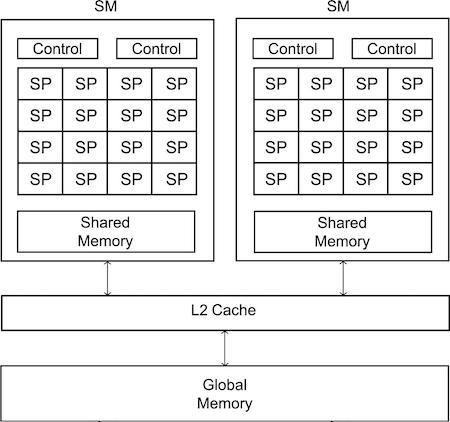

# 445-practice-cuda

Now we will start on our adventure with GPU computing!

We will primarily be using a new library called openACC with pragmas and functions like openMP uses. However, it is helpful to understand what is underneath this library by seeing a different low-level compiler called `nvcc` that uses a library called CUDA to enable developers to create code to run on a GPU card and to specify how many threads to use. This CUDA programming library is specific to GPU cards that follow NVIDIA architecture specifications.

## A host and a device

The GPU cards typically are added to a server, called a host, and look something like this:


In general purpose GPU computing, the GPU card is called a device. Inside it are thousands of small cores that tend to be slower than our very fast CPU cores on the host server. The GPU cores share some memory that is organized differently, yet has some similarities to our CPU memory architecture. See figures 6.1 and 6.2 of your textbook by Pacheco and Malensek for diagrams depicting the general GPU and host architecture.

------

 **A key aspect of GPU computing is that data needed for a computation must be copied from the host to the device and from the device back to the host when the computation is finished.** We will explore this with a very simple example in the second folder, called 2-vectorAdd.

In current GPU devices and CUDA library code, we can also use a concept called *unified memory*, where this data copying is handled for the programmer and the programming abstraction is that one memory is available to both the host and the device. We will look at this in the third folder, called 3-UMVectorAdd

-------

## Necessary background reading

You should read Sections 6.1 - 6.6 of your Pacheco and Malensek textbook so that you understand the architecture of these cards (6.1 - 6.3) and how in code we specify how many threads we want (6.4 - 6.6).

# The basics 

## Folder: 1-basics

Let's begin our exploration of CUDA programming and the nvcc compiler by looking at the code in the folder called 1-basics. First, look at the file called `device_info.cu`. Note how it uses a function defined in `helper_cuda.h` called `getDeviceInformation()`. - take a look at the CUDA functions used in there to tell us about our device. Build two programs and run the first one like this:

    make
    ./device_info

Note that our device has 40 streaming multiprocessors (SMs). From your textbook, at a very general level the architecture of an NVIDIA GPU device looks like this, with the number of SMs total varying by device:



Notice something that isn't readily available to query about our device: the number of SPs per SM. A streaming mutiprocessor (SM) on our device has 48 'cores'. However, this is deceiving, because some can only execute certain kinds of instructions. So in general we cannot and should not get too detailed about specifying which SM and which SPs within them our code should run on.

Instead, we signify in our code that we want **blocks** of threads to be assigned to a certain task. Each block that you specify maps to an SM. Note from the output of `device_info` how many maximum threads per block we can specify. The actual assignment of threads to run instructions in your code is done by a specialized miniature operating system on the device called a **warp scheduler**. A warp is a term quite specific to NVIDIA's devices- 32 threads are scheduled at a time by the warp scheduler.

 Note that threads in blocks should be organized as multiples of 32, since the warp scheduler assigns computations this way.

To see the blocks of threads in action, next look at the file called `simpleBlockPrintf.cu`. 

 Let's try running this example:

    ./simpleBlockPrintf

Scroll back up to the beginning of the output and note what it looks like for this section of code:

```C
// 1 block of 32 threads goes to 1 SM 
  test1DGridKernel<<<1, 32>>>(10);
```

The syntax above is indicating 1 block of 32 threads should run a function called test1DGridKernel on the device. NVIDIA has given this special nomenclature to functions that run on the device as *kernels*. This and the other two examples are purely for illustration of how the NVIDIA CUDA library enables you to assign blocks of threads. 

The second example illustrates a 1D 'grid' of 2 1D blocks.

The third example illustrates a 2D grid of 2D blocks of threads. Note here how we must set up the dimensions by using a special data structure called dim3 that is provided as part of CUDA.

As you can see from the fourth example, we can introduce a 2 dimensional grid and 3 dimensions to blocks themselves. Luckily, for many types of computations you may not have to worry about sophisticated grids of blocks of threads like this.

## CUDA's barrier pattern

Look for this line of code in `simpleBlockPrintf.cu`:

```
cudaDeviceSynchronize();         // comment and re-make and run
```

Observe what happens when you comment out this line of code and rebuild and rerun it. In effect, `cudaDeviceSynchronize()` serves the purpose of our barrier pattern: all computation ahead of this must complete on the device before moving forward to the next kernel function execution.

# vector Addition: the real 'hello, world' of GPU computing
## Folder: 2-vectorAdd

Go over to the 2-vectorAdd directory on your mscs1 account. This example illustrates the case where the programmer manages the memory allocation on the device and all of the data movement. Study the code in vectorAdd.cu.

Build and run as usual:

    make
    ./vectorAdd

Note that for illustration we are using arrays x and y that have 1048576 elements, which is a multiple of 1024, which happens to be the maximum number of threads per block that we can specify.

You could experiment with trying a larger array size and/or different threads per block, however it is a good practice to make sure that the array size is divisible by 32 (the number of SPs in an SM and the size of threads that get scheduled by the warp scheduler).

There is a function to check whether the result is correct- if you try something different and you didn't quite get it right, this will let you know.

 Note how the kernel vecAdd function is written so that each thread determines a unique thread id and uses that as an index into the array. **This is the most common CUDA way:** program as if each thread is working on one data element.

# Vector addition using unified memory
## Folder: 3-vectorAdd
Go over to the 2-vectorAdd directory on your mscs1 account. This example illustrates the case where memory is managed between device and host more easily by setting up "unified memory". Study the code and compare it to the previous version. Note how it is simplified.

The managed memory is typically how you will now write CUDA code, since there does not seem to be much of a performance hit for writing the code this way. It is a convenience added into the CUDA compiler to make the setup and mapping of data the needs to be copied to the device easier.

Modern NVIDIA GPU cards enable us to simply specify that we want the data that we need on the device to be 'managed' so that copies of the specified arrays are moved over to the device when needed. This is indicated with these calls, similar to C's malloc command for dynamic memory allocation:

```C
  // Allocate Unified Memory – accessible from CPU or GPU
  cudaMallocManaged(&x, N*sizeof(float));
  cudaMallocManaged(&y, N*sizeof(float));
  ```

Note that for illustration we are using arrays x and y that have 1048576 elements, which is a multiple of 1024, which happens to be the maximum number of threads per block that we can specify.

Build and run as usual:

    make
    ./vectorAdd


# timing vector addition with various scenarios

## Folder: 4-vectorAdd

Go over to the 4-vectorAdd directory on your mscs1 account. First just make the code, then read on how to look at the code and interpret the results.

    make

This example is modified from [this NVIDIA web site](https://developer.nvidia.com/blog/even-easier-introduction-cuda/). It is similar to the example in your textbook in section 6.8.

A GPU computation at a minimum will almost certainly involve moving data, either from the host to the device and back, or at least from the device back to the host when a computation is computed. This particular example of adding two vectors represents a very small amount of computation on the device after moving two input vectors over to it from the host, then the resulting computation needs to be moved back. This is why this example is often considered a basic 'hello world' type of example for general GPU computing.

## Data movement is 'managed'

Modern NVIDIA GPU cards enable us to simply specify that we want the data that we need on the device to be 'managed' so that copies of the specified arrays are moved over to the device when needed. This is indicated with these calls, similar to C's malloc command for dynamic memory allocation:

```C
  // Allocate Unified Memory – accessible from CPU or GPU
  cudaMallocManaged(&x, N*sizeof(float));
  cudaMallocManaged(&y, N*sizeof(float));
  ```

Note that for illustration we are using arrays x and y that have 1048576 elements, which is a multiple of 1024, which happens to be the maximum number of threads per block that we can specify.

## Sequential execution on a 'core' on the device

Look at the function `add`. This code does not set up assigning of the array elements to threads. Compare it to the functions called   `add_parallel_1block` and `add_parallel_nblocks`. Note the comments and the use of the variable called stride to set up the mapping of threads in blocks to elements of the array.

Luckily, we will soon be using openACC pragma directives soon that enable us to not worry about these details when parallelizing our code for running on a device.

Note that the first version of adding the vectors uses this sequential method on one device thread and prints out a time for this.

Run it to see this:

    ./vectorAdd

## Parallel execution on one block of threads

The code also resets the array elements and tries one block of 256 threads, reporting the time to run it that way.

CUDA GPU warp schedulers run kernels using blocks of threads that are a multiple of 32 in size, so multiples of 32, such as 256 threads is one size we could choose. Note that we used this as the default if you do not add command line arguments.

## Parallel execution using multiple blocks of threads.

We found out that our device has a maximum of 1024 threads that we can declare per block. In this example we first use fewer than that: 256.

If we want to use 4096 blocks of 256 threads, the mapping to our 1D arrays of floats x and y would look something like this, where each of the 256 threads is assigned to do the addition in this manner:


When you run the code without command line arguments, the time for this type of mapping is given.

    ./vectorAdd

Now experiment by using the command line to specify the maximum number of threads, 1024, like this:

    ./vectorAdd 1024

What do you observe about the time for this configuration versus the previous one using a default of 256 threads per block?

Ultimately, we can sometimes get a faster time using an interesting number of blocks: 40. This matches our particular NVIDIA device's number of SMs. Try running this a few times:

    ./vectorAdd 1024 40

## Luckily, we can avoid much of this

Next we will use the openACC library and pragmas to avoid some of these messy details about scheduling code to run on blocks of threads.

The new compiler, called `pgcc` is remarkably good at determining how to map the threads for our loops by knowing some of the information about our card's architecture to create optimized code like we created manually here.

Just like openMP compilers create pthreads code for us, `pgcc` will be able to create both pthreads code if we ask for it or CUDA code like you have studied here, without is needing to worry about calculating a stride for the for loop or setting up the number of blocks with a certain number of threads in them.


