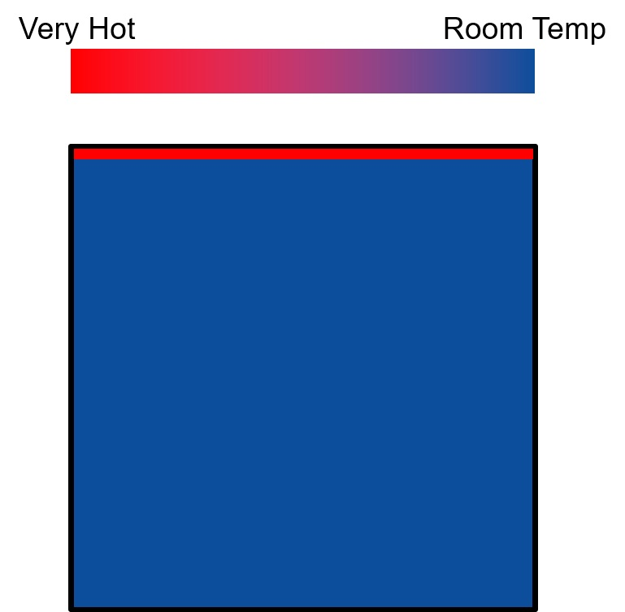
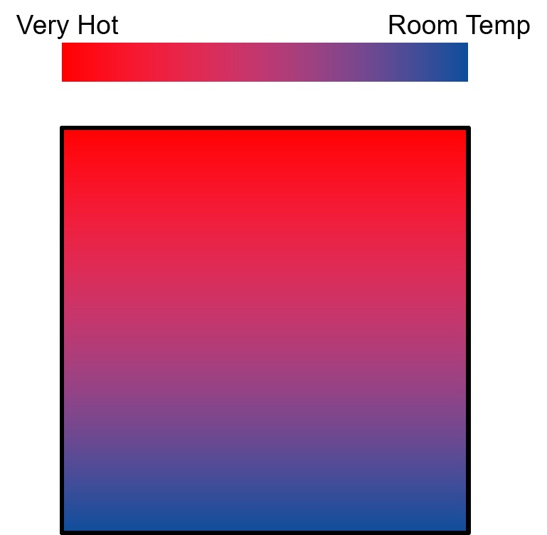
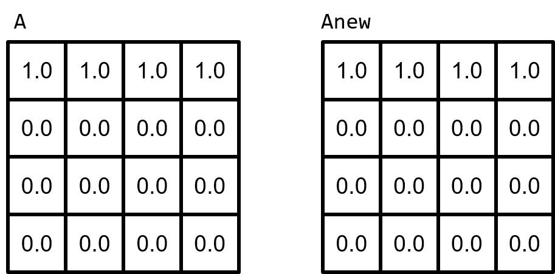
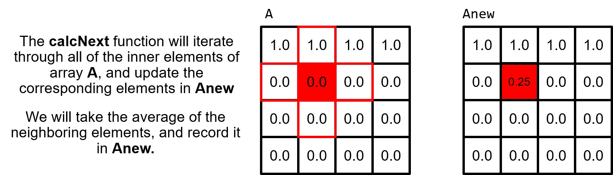
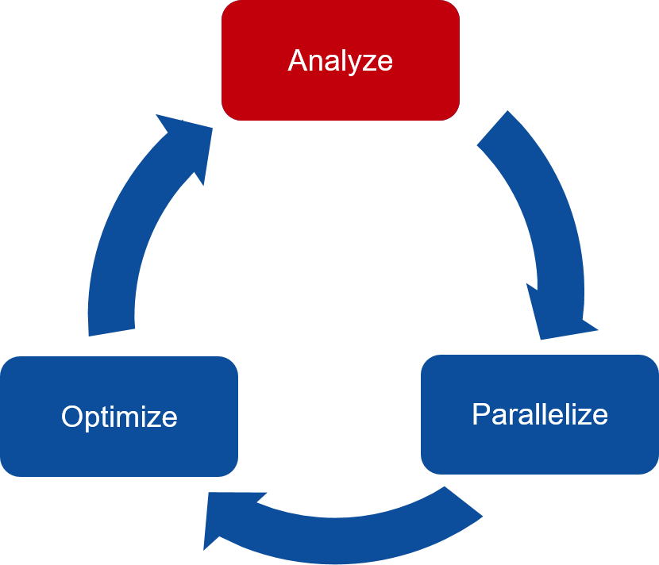
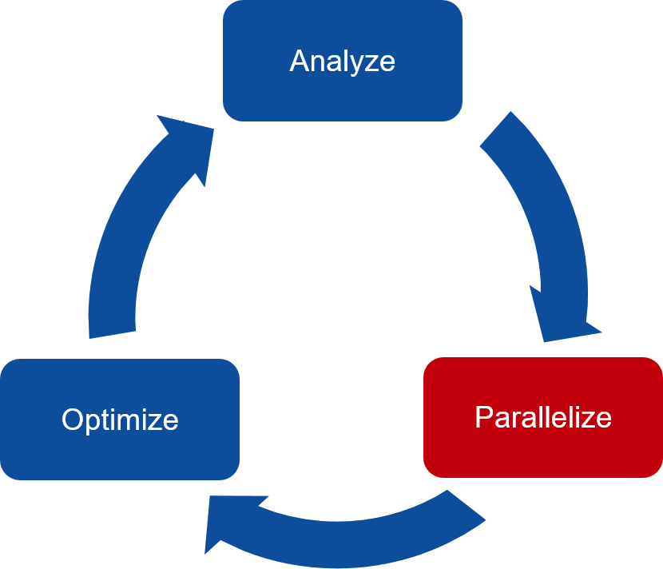
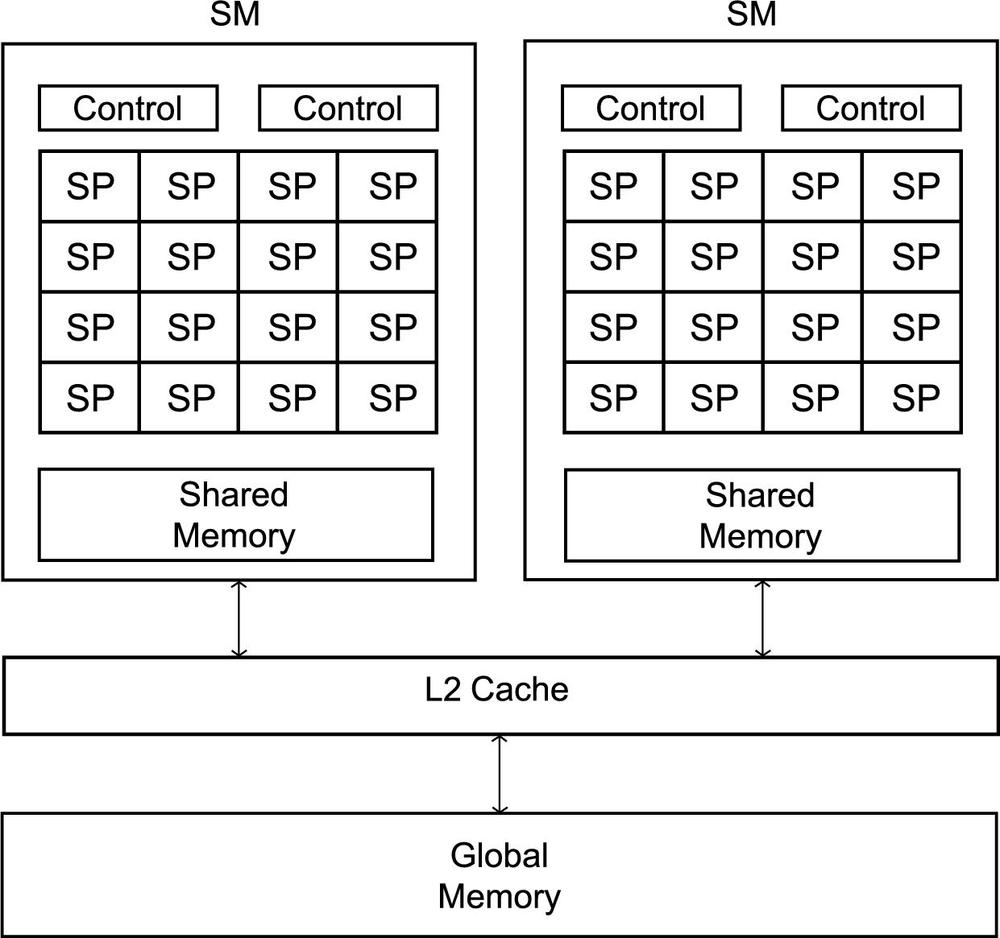

# OpenACC : A new standard and compiler

The software libraries and compilers that we have used so far, OpenMP and MPI, are at their core **standards**. These standards are written to dictate what functionality the compiler and the associated libraries should provide. We have used gcc and g++ for compiling C and C++ code. These compilers conform to the OpenMP standard. The OpenMP standard has several versions, and each successive version of gcc and g++ adds most of the features of the new version of the standard. There are other compilers for C and C++ that also follow the OpenMP standard. MPI libraries and compilers and associated programs like mpirun are also defined in a standard. There are two primary versions of MPI that we can install: MPICH and OpenMPI. You have actually used one of each, as we have OpenMPI on the Raspberry Pis and MPICH on the mscs1 server.

These two standards, OpenMP for shared memory CPU computing, and MPI for distributed networked systems or single machines, each work with traditional multicore CPU computers. As we have seen, they can give us reasonable scalability to perform better and work on larger problems.

Yet many computational problems need much larger scalability. The field of supercomputing exists to develop hardware and software to handle these scalability needs. One aspect of providing more scalability is to turn to special devices that can be installed along with a multicore CPU. Graphics processing units, or GPUs, are such a type of accelerator. Today GPUS come in all sorts of sizes, from small ones for mobile devices and laptops to large ones like this that are separate cards containing thousands of small cores that are slower than a typical CPU chip:


Because GPUs are special hardware with thousands of cores, using them for parallelism is often called manycore computing. They were first designed to off load graphics computations to speed up response time for applications such as games or visualizations. Now they are used for speeding up general computations as well. 

To do this, we will be using a specific **new compiler called pgcc**, based on a different standard called OpenACC. The ACC part of OpenACC stands for accelerator. Separate cards such as GPUs are often referred to as accelerators when they are used for accelerating  certain types of computations. The pgcc compiler is one a several compilers written originally by the Portland Group (PGI), which is now owned by NVIDIA, the major GPU manufacturer and inventor of the CUDA language compilers for running code on GPUS.


## A new compiler

The `pgcc` compiler will process code with pragma lines similar to those of OpenMP into different versions of code:

1. regular sequential version (when no pragmas present)
2. shared memory version using OpenMP  (backwards compatible with OpenMP)
2. multicore version for the CPU    (new pragmas defined in OpenACC standard)
3. manycore version for the GPU     (additional pragmas for accelerator computation)

As you will see, the OpenACC standard and the PGI compilers are designed to enable software developers the ability to write one program, or begin with one sequential program or OpenMP program, and easily transform it to a program that can run a larger sized problem faster by using thousands of threads on a GPU device.

----

# Goals

One goal for this lab is to learn what exactly code profiling is, and how we can use it to help us write powerful parallel programs.  

Another goal is to become familiar with using the pgcc compiler, which is a very advanced compiler designed for use with multicore and GPU hardware, using a new set of compiler pragmas for OpenAcc.

A last goal is to become familiar with a prevalent computational pattern in scientific computing, the structured grid, that is pretty easy to parallelize with large gains in reducing runtime.

----

# Background: One problem, several code versions

Jacobi iteration is a standard iterative method for finding solutions to a system of n linear equations in m unknowns. This method is iterative, performing many iterations until there is convergence within a given amount of error. 

This code you have here uses this method to simulate heat distribution over a plate as it changes over time. It is relatively simple to understand, yet is computationally expensive when n and m and the number of iterations get large. This makes it a good candidate for studying how we can improve a sequential version of this code. 

The program you will study has several versions, each in its own folder:

- 1-sequential, compiled with both gcc and the new pgcc compiler
- 2-openMP, compiled with gcc and pgcc
- 3-openacc-multicore, compiled with pgcc
- 4-openacc-gpu, compiled with pgcc

The 1-sequential program code is in two files:

1. `jacobi.c`, which has a main function that performs many iterations of a laplace transform on a 2D matrix of floating point values. This matrix represents the n equations with m unknown values.
2. `laplace2d.c`, which contains functions to do the following:
  - initialize the matrix, 
  - determine a new state based on the past state of the matrix, and
  - update the past state to contain the newly computed state.

You should read through these two files on your own, but we will also highlight the most important parts below in the "Code Breakdown".

## Simulation code that has a classic parallel pattern

The code simulates heat distribution across a 2-dimensional metal plate. In the beginning, the plate will be unheated, meaning that the entire plate will be room temperature. A constant heat will be applied to the edge of the plate and the code will simulate that heat distributing across the plate over time.  

**Aside about patterns:** This type of application is often called a 2D mesh, where the plate is simulated as 2-dimensional set of points. The class of problems that this code falls into is also sometimes called a cellular automata. In the parallel patterns diagram, this is in the class of computational patterns on the left hand side called 'Structured Grids'. See [https://patterns.eecs.berkeley.edu/?page_id=498](https://patterns.eecs.berkeley.edu/?page_id=498): the file for this example is called jacobi.c because of the Jacobi method used on the grid, which can be used for many problems, as described on this web page.

**TO DO:**

1. Find Structured Grid on the parallel patterns diagram along the left as a computational pattern. This type of code that you are studying here is well used in scientific programming and can have very good parallel solutions.
2. In the link to the [Berkeley patterns page](https://patterns.eecs.berkeley.edu/?page_id=498), find the definition of a stencil. Note how this is applied in the code as you study it.

If you want to know more details of the mathematics for combining Lapalce transforms and Jacobi iterations, please see [https://www.dais.unive.it/~calpar/New_HPC_course/AA16-17/Project-Jacobi.pdf](https://www.dais.unive.it/~calpar/New_HPC_course/AA16-17/Project-Jacobi.pdf). This also shows how this method is used for simulating heat distribution over time on a 2D plate.

----

# PART 1: the sequential version

Folder: jacobi-laplace/1-sequential

This version has no parallelization, but it does compile a sequential version using 2 different compilers:
1. gcc, using two levels of optimization of the binary executable code produced.
2. pgcc, using its optimization level that creates the fastest code.

When you do a 'make', you will create three different executable binary programs:

1. laplace_gcc
2. laplace_gcc_O3
3. laplace_pgcc

Look carefully at the compile line flags that are used to create each of these by observing what make prints out as these versions are compiled. Also note that the pgcc compiler is adding one more optimization on one of the loops (this is reported by the -Minfo=opt flag).

Notice that compiler optimization flags are used to attempt to create faster code by using special features of the CPU. The -O3 command line flag will be highly optimized and should produce correct code. The -fast flag will usually create even faster code, but there are cases when it might be incorrect. In our case, as you run this code you will see that the results appear to be the same between the -O3 optimization and the -fast optimization.

## Two compilers, slightly different binary executable code

As you run the following examples, observe that the timings are different for each version of the binary executable. This is because each compiler is different and can create different executable code.

First try a small problem that will run fairly quickly sequentially.

    ./laplace_gcc_O3 -n 256 -m 256

    ./laplace_gcc -n 256 -m 256

    ./laplace_pgcc -n 256 -m 256

What do you observe about the reported results and the time to run each one?

## Understanding Code Results

The output from our program will make more sense as you analyze the code. The most important thing to keep in mind is that we need these output values to stay consistent. For a given set of n,m values, if these outputs change during any point while we parallelize our code, we know we've made a mistake. For simplicity, focus on the last output, which occurred at iteration 900. It is also helpful to record the time the program took to run. Our goal while parallelizing the code is ultimately to make it faster, so we need to know our "base runtime" in order to know if the code is running faster. This will require patience, but run the fastest version one time without the -n and -m flags to get a base time for a default problem size of 409x4096, like this:

    ./laplace_pgcc

 In the long run, how much the code scales will need to be measured differently than you have studied so far. The optimizations that this new compiler can accomplish with a GPU will mean that we will describe the code in terms of how many times faster than the optimized sequential version each new version is.

---------

# Code Breakdown

As we said, this code simulates the change of heat across a plate. This is a visual representation of the plate before the simulation starts:  


<p></p>

**Note that our code does not produce a graphic as shown above.** This is merely to illustrate what this code is computing.

We can see that the plate is uniformly room temperature, except for the top edge. Within the *laplace2d.c* file, we see a function called **`initialize`**. This function is what "heats" the top edge of the plate.

```
void initialize(double *restrict A, double *restrict Anew, int m, int n)  
{  
    memset(A, 0, n * m * sizeof(double));  
    memset(Anew, 0, n * m * sizeof(double));  

    for(int i = 0; i < m; i++){  
        A[i] = 1.0;  
        Anew[i] = 1.0;  
    }  
}  
```

After the top edge is heated, the code will simulate the heat distributing across the length of the plate. We will keep the top edge at a constant heat as the simulation progresses.

This is the plate after several iterations of our simulation:  

<!--

-->

<p></p>

That's the theory: simple heat distribution. However, we are more interested in how the code works.


The 2-dimensional plate is represented by a 2-dimensional array containing double-precision floating point values. These doubles represent temperature; 0.0 is room temperature, and 1.0 is our max temperature. The 2-dimensional plate has two states, one represents the current temperature, and one represents the expected temperature values at the next step in our simulation. These two states are represented by arrays **`A`** and **`Anew`** respectively. The following is a visual representation of these arrays, with the top edge "heated".

<p></p>

Simulating this state in two arrays is very important for our **`calcNext`** function. Our calcNext is essentially our "simulate" function. calcNext will look at the inner elements of A (meaning everything except for the edges of the plate) and update each element's temperature based on the temperature of its neighbors.  If we attempted to calculate in-place (using only **`A`**), then each element would calculate its new temperature based on the updated temperature of previous elements. This data dependency not only prevents parallelizing the code, but would also result in incorrect results when run in serial. By calculating into the temporary array **`Anew`** we ensure that an entire step of our simulation has completed before updating the **`A`** array.

  

Below is the **`calcNext`** function:
```
01 double calcNext(double *restrict A, double *restrict Anew, int m, int n)
02 {
03     double error = 0.0;  
04     for( int j = 1; j < n-1; j++)  
05     {  
06        for( int i = 1; i < m-1; i++ )   
07        {  
08            Anew[OFFSET(j, i, m)] = 0.25 * ( A[OFFSET(j, i+1, m)] + A[OFFSET(j, i-1, m)]  
09                                           + A[OFFSET(j-1, i, m)] + A[OFFSET(j+1, i, m)]);  
10            error = fmax( error, fabs(Anew[OFFSET(j, i, m)] - A[OFFSET(j, i , m)]));  
11        }  
12    }  
13    return error;  
14 }  
```

We see on lines 08 and 09 where we are calculating the value of **`Anew`** at **`i,j`** by averaging the current values of its neighbors. Line 10 is where we calculate the current rate of change for the simulation by looking at how much the **`i,j`** element changed during this step and finding the maximum value for this **`error`**. This allows us to short-circuit our simulation if it reaches a steady state before we've completed our maximum number of iterations.

Lastly, our **`swap`** function will copy the contents of **`Anew`** to **`A`**.

```
01 void swap(double *restrict A, double *restrict Anew, int m, int n)
02 {
03    for( int j = 1; j < n-1; j++)
04    {
05        for( int i = 1; i < m-1; i++ )
06        {
07            A[OFFSET(j, i, m)] = Anew[OFFSET(j, i, m)];    
08        }
09    }
10 }
```

-------

### The 'problem size' is more complicated

Since we have a 2D matrix here, the size of our problem changes by changing either or both of the n and m values for the size of the matrix. In addition, we can also change the problem size by increasing or decreasing the maximum number of iterations.

This will double the problem size:

    ./laplace_pgcc -n 512 -m 256

And this will be 4 times the problem size:

    ./laplace_pgcc -n 512 -m 512

The iterations in the jacobi loop are set as a maximum, so the program might do fewer if it converges. So varying this to change the problem size can be tricky. This one will double the previous size:

    ./laplace_pgcc -n 512 -m 512 -i 2000

using 4000 and 8000 iterations will still not converge within the tolerance specified in the program, but by 8000 iterations you can see that it may not converge any further (the error after each 100 iterations is being printed).

---------


# PART 2: Two OpenMP versions

Folder: jacobi-laplace/2-openMP

There are two openMP versions that are compiled with gcc  and pgcc in this folder.

The makers of the pgccc compiler wanted to ensure that code with omp pragmas that could be compiled with gcc or any other compiler that supports openMP could also be compiled with the pgcc compiler. This directory demonstrates this.

Look at the makefile to note that we now have a new flag for the pgcc compiler: -mp. This serves the same purpose as the -fopenmp flag of gcc. It enables us to use omp_set_num_threads() in this version of the code.

    make

When you make, note that two versions are created. You can run each one like this:

    ./laplace_omp_gcc -n 512 -m 512 -t 2
    ./laplace_omp_gcc -n 512 -m 512 -t 4
    ./laplace_omp_gcc -n 512 -m 512 -t 8
    ./laplace_omp_gcc -n 512 -m 512 -t 16

    ./laplace_omp_pgcc -n 512 -m 512 -t 2
    ./laplace_omp_pgcc -n 512 -m 512 -t 4
    ./laplace_omp_pgcc -n 512 -m 512 -t 8
    ./laplace_omp_pgcc -n 512 -m 512 -t 16

----

# PART 3: A multicore version using pgcc

Folder: jacobi-laplace/openacc-multicore

The developers of the pgcc compiler designed their compiler to build 'multicore' versions of code that used their own pragmas to fork threads. The code here behaves the same as the openMP version.

Look at the file jacobi.c in this directory to see that the pgcc compiler has a function called `acc_set_num_cores()` that is used to set the number of cores to use. Then notice in the file called laplace2d.parallel.c that the two pragmas on the loops look like this:

    #pragma acc parallel loop reduction(max:error)

    #pragma acc parallel loop

The advantage of the pgcc compiler is that it is much smarter about determining what should be shared and private. This is part of the standard for openACC. Note that you do need to indicate the reduction needed, however.

Now do the make and run this version and the openMP one to see that the results are very close to each other in time. Try these:

    ./laplace_multicore_pgcc -n 512 -m 512 -t 2

    ../openMP/laplace_omp_pgcc -n 512 -m 512 -t 2

    /laplace_multicore_pgcc -n 512 -m 512 -t 4
    ../openMP/laplace_omp_pgcc -n 512 -m 512 -t 4

    /laplace_multicore_pgcc -n 512 -m 512 -t 8
    ../openMP/laplace_omp_pgcc -n 512 -m 512 -t 8

    /laplace_multicore_pgcc -n 512 -m 512 -t 16
    ../openMP/laplace_omp_pgcc -n 512 -m 512 -t 16

-----

# Profiling sequential and multicore code first

Before we use the GPU, it is always necessary to conduct an analysis that tells us what parts of our code are taking the longest time to run. This is called code *profiling*.

Let's start by considering the way we work to parallelize existing code solutions. We will follow a process that is visualized like this:

<!--

-->

<!--

-->


<p></p>

Above is the OpenACC 3-Step development cycle, and indeed the development cycle for improving performance of any program.

**Analyze** your original sequential code to determine most likely places needing parallelization or optimization.

**Parallelize** your code by starting with the most time consuming parts and check for correctness.

**Optimize** your code to improve observed speed-up from parallelization.

We are currently tackling the **analyze** step. We will use a code profiler called nvprof to get an understanding of this code before moving onto the next two steps. Code profilers execute the code while keeping track of how much time was spent running certain functions. If we have code that is decomposed into separate functions that complete certain tasks, then we can discover which functions take the most time so that we can target those for parallelizing.

 The profiler tool called `nvprof` works with code compiled using the `pgcc` compiler or the NVIDIA cuda compiler, `nvcc`, which you saw in a previous activity.

---

## Run the Code: sequential version

Let's go back to the sequential version of the code in:

    jacobi-laplace/1-sequential

It should already have a compiled program called `laplace_pgcc` that was made with the pgcc compiler.

Our first step to analyzing this code more carefully is to run it with the profiler tool. We need to record the results of our program before making any parallelization changes so that we can compare them to the results from the parallel code later on. It is also important to record the time that the program takes to run, as this will be our primary indicator to whether or not our parallelization is improving performance.

By now you should have a good idea of what the code is doing. If not, go spend a little more time in the previous sections to ensure you understand the code before moving forward. Now it's time to profile the code to get a better understanding of where the application is spending its runtime. To profile our code we will be using `nvprof`, which is a command-line or visual profiler from NVIDIA.

We will use the command-line version, since we are accessing our server remotely, rather than at a monitor connected to it. You can see details about the use of the profiler by looking at [the nvprof user guide pdf file](https://docs.nvidia.com/cuda/pdf/CUDA_Profiler_Users_Guide.pdf), or it might be easier to look at the web page version linked below. 


-----
### Important

Be sure to go to the command-line version on page 42 of the pdf version of user guide. This is because you will only use this tool remotely from the command line on the terminal. 

Perhaps even more helpful is an html version of the user guide- go here to skip to the command line options: [https://docs.nvidia.com/cuda/profiler-users-guide/index.html#nvprof-command-line-options](https://docs.nvidia.com/cuda/profiler-users-guide/index.html#nvprof-command-line-options)

----

You can also get some information about all the various options by typing  at the terminal:

```sh
nvprof --help
```

 Profiling with nvprof is a 2-step process:

1. Run the profiler to run the code, collecting statistics in an output file.
2. Run the profiler with the previous output file as input to report parts of the statistics you wish to see.


Step 1: You can run `nvprof` and generate profiling output in a file called `laplace.prof` like this:

```sh
nvprof --cpu-profiling on -o laplace.prof ./laplace_pgcc
```

We are running a much larger problem size now, the default 4096 x 4096 mesh, so be patient as it computes the sequential version of this code.

Step 2: Once you have a profiling output file called *laplace.prof*, you can see a report from it like this:

```sh
nvprof --cpu-profiling-mode top-down -i laplace.prof
```

Since our application is run entirely on the CPU, we chose the cpu-profiling-mode option. The top-down option reports information by showing those functions that took the most time first. You should see something like this:

```
======== CPU profiling result (top down):
Time(%)      Time  Name
 53.06%  25.2101s  calcNext
 46.52%  22.1001s  __c_mcopy8_sky
  0.27%     130ms  initialize
  0.27%     130ms  | __GI_memset
  0.06%      30ms  __c_mcopy8
  0.06%      30ms  main
  0.02%      10ms  | munmap
  0.02%      10ms  | printf
  0.02%      10ms  |   _IO_vfprintf
  0.02%      10ms  |     __printf_fp_l
  0.02%      10ms  swap

======== Data collected at 100Hz frequency
```

This output is showing the time spent in each function, most time first.  Functions called by functions are nested by showing indentation with  | symbol, such as printf inside main. There are clearly 2 places where most of the time is spent. You easily could have guessed this with this simple code, but it won't always be like that for other code.

---

  **IMPORTANT NOTE:** 

Having your code decomposed into functions makes it easier to use profiling analysis as we are doing in this example. If we did not have those two functions in laplace2d.c, the output from the compiler would have been harder to decipher.

---

### Where is the c_mcopy8_sky coming from?

Recall that even with a sequential code, the `pgcc` compiler is performing a lot of optimizations, because of our choice to use -fast option. Recall that we compiled the code with the **`-Minfo=opt`** flag, which instructs  the compiler to print additional information about how it optimized the code. 


From the compilation, you could see that the **`__c_mcopy8`** is actually an optimization that is being applied to the **`swap`** function. Notice in the output below that at line 63 of **`laplace2d.c`**, which happens inside the **`swap`** routine, that the compiler determined that our loops are performing a memory copy between two arrays, which it believes can be performed more efficiently by calling the **`__c_mcopy8`** function instead.

```
laplace2d.c:
swap:
     79, Memory copy idiom, loop replaced by call to __c_mcopy8
```

So now we can interpret our profiler results this way:

The function calcNext takes the most time, followed closely by swap.

If you are really interested, you could eliminate the -fast when compiling with pgcc and try profiling again. Beware that the code runs much slower. What you would get should be something like this, showing a bit more easily how calcNext and swap take the majority of the time:

```
======== CPU profiling result (top down):
Time(%)      Time  Name
 100.00%  125.914s  ???
 100.00%  125.914s    main
 70.86%  89.2229s      calcNext
 29.02%  36.5412s      swap
  0.11%     140ms      initialize
  0.11%     140ms      | __GI_memset
  0.01%      10ms      deallocate
  0.01%      10ms        munmap
```

---

## Profile Our Parallel Code on Multicore CPU

Now go over to the jacobi-laplace/openacc-multicore folder.

You have already seen how the `pgcc` compiler could create a multicore version of this code that was very similar in performance to the OpenMP version.

When we compiled this version, we used special flags for this compiler. Here is a brief overview of what is available. Note what we used in the Makefile.

**-ta** : This flag will tell the compiler to compile our code for a specific parallel hardware. TA stands for "Target Accelerator", an accelerator being any device that accelerates performance (in our case, this means parallel hardware.) Omitting the -ta flag will cause the code to compile sequentially.  

**-ta=multicore** will tell the compiler to parallelize the code specifically for a multicore CPU.  

**-Minfo** : This flag will tell the compiler to give us some feedback when compiling the code.  

**-Minfo=accel** : will only give us feedback about the parallelization of our code. 

**-Minfo=opt** : will give us feedback about sequential optimizations.  

**-Minfo=all** : will give all feedback; this includes feedback about parallelizaiton, sequential optimizations, and even parts of the code that couldn't be optimized for one reason or another.  

If you would like to see the c_mcopy8 from earlier, try switching the Minfo flag with **-Minfo=accel,opt**.

---

## Profiling Multicore Code

You can run `nvprof` and generate profiling output in a file like this:


```sh
nvprof --cpu-profiling off --openacc-profiling on -f -o laplace_multicore.prof ./laplace_multicore_pgcc -t 4
```

Once you have a profiling output file called *laplace_multicore.prof*, you can see a report from it like this:

```sh
nvprof -f -i laplace_multicore.prof 
```

Note that each of these can be run with make like this:

```sh
make multicore_profile
```

As you might expect, the output is quite a bit different. 


```
======== Profiling result:
No kernels were profiled.
No API activities were profiled.
            Type  Time(%)      Time     Calls       Avg       Min       Max  Name
 OpenACC (excl):   51.55%  7.85310s      1000  7.8531ms  7.3357ms  24.490ms  acc_compute_construct@laplace2d.parallel.c:47
                   48.45%  7.38005s      1000  7.3800ms  6.9446ms  16.015ms  acc_compute_construct@laplace2d.parallel.c:62
```

What we will learn later is that on lines 62 and 47 of a file called *laplace2d.parallel.c* there are openacc pragmas that parallelized the code inside the *swap* and *calcNext* functions respectively. Because of the way we compiled it, it was running on multicore threads.

Note how much time *calcNext* and *swap*  **seemed to take** in the output labeled **CPU profiling result** compared to the original sequential version. 

Here is some example output from the sequential version again:

```
nvprof --cpu-profiling-mode top-down -i laplace.prof

======== CPU profiling result (top down):
Time(%)      Time  Name
 52.72%  24.6101s  calcNext
 47.00%  21.9401s  __c_mcopy8_sky
  0.19%      90ms  initialize
  0.19%      90ms  | __GI_memset
  0.04%      20ms  swap
  0.02%      10ms  __c_mcopy8
  0.02%      10ms  deallocate
  0.02%      10ms    munmap

======== Data collected at 100Hz frequency
```

Note how long the *\__c_mcopy8_sky* function, which is the optimization of the *swap* function, took compared to the line 62 pragma line inside it for the openacc parallelized version. There is a similar increase in the *calcNext* function (line 47 for the openacc pragma).

## Profiling tells us what to focus on

Now we have a good understanding of how our program is running, and which parts of the program are time consuming. Next we will parallelize our program for the GPU using OpenACC.

We are working on a very simple code that is specifically used for teaching purposes. Meaning that, in terms of complexity, it can be fairly underwhelming. Profiling code will become exponentially more useful if you chose to work on a "real-world" code; a code with possibly hundreds of functions, or millions of lines of code. Profiling may seem trivial when we only have 4 functions, and our entire code is contained in only two files, however, profiling will be one of your greatest assets when parallelizing real-world code.


--------

# PART 4: GPU 'manycore' version

You have seen some GPU code using NVIDIA's CUDA compiler directives and using their compiler, called nvcc, in a previous activity.

The OpenACC manycore GPU version of our heated plate simulation in the jacobi-laplace/4-openacc-gpu folder has code that can be sent over to the graphics card and be run there, much like was done with our CUDA code examples. Once completed, the results from the computation are returned to the memory of the CPU-based 'host' machine in which the card is located. Our sever, mscs1, has one of these GPU cards from NVIDIA that we will use for general purpose computations where results from it will be sent back to the main server. This is all done within the context of a single C/C++ program.

---

## Next step in the development process

We are now getting into the parallelize step of the parallel development process for GPU computing:

<p></p>


**Analyze** your code, and predict where potential parallelism can be uncovered. Use profiler to help understand what is happening in the code, and where parallelism may exist.

**Parallelize** your code, starting with the most time consuming parts. Focus on maintaining correct results from your program.

**Optimize** your code, focusing on maximizing performance. Performance may not increase all-at-once during early parallelization.

We are currently tackling the **parallelize** step for the GPU using OpenAcc. We will include the OpenACC data directives to parallelize properly manage data within our parallelized code. Note that we are also letting the compiler handle most of the optimize step, although you will see that we will intervene some.

---

## Get GPU information

Let's execute the command below to display information about the GPUs running on the server by running the `pgaccelinfo` command, which ships with the PGI compiler that we have been using.

```sh
pgaccelinfo
```

You saw how we could get some of this information programmatically using cuda functions in the last activity. 

Now let's use that GPU with the pgcc compiler to make this code example run amazingly fast. From the profiling of the sequential version, we found out where the code is taking most of its time to execute. Now we will use that info to run those functions on the GPU with its thousands of small little cores.

Note this line in the output from `pgaccelinfo` that should look something like this:

    Global Memory Size:            15843721216

This is the size of the memory that all of the cores share, which is about 15.38437 GigaBytes (15843721216 bytes) in this case. Note that this is smaller than the total amount of memory on the host. To find out how much memory is on the host machine in gigabytes, type this:

    free -g

Note how many gigabytes our CPU has available on the host machine compared to the GPU.

Note the last line produced from the `pgaccelinfo` command, which will look like this:

    Default Target:            cc75

That indicates the target architecture that we should use when compiling the code to run on the GPU card. This means that when we want to use the GPU card, we will use this flag on the command line with pgcc:

    pgcc -ta=tesla:cc75 ...

----
# Using the OpenACC kernels Directive: Running on the GPU

Now we are finally going to look at how this compiler, pgcc, and the OpenAcc directives can generate code to run on the GPU. The basic principle of computing on a GPU, which has thousands of cores, is that programmers need to define each function that should be shipped over to the GPU and run there on those thousands of cores. Along with the kernel functions, data that those functions access and create must be shipped over and shipped back respectively.

Just as OpenMP pragma directives signal the compiler to create code that uses the operating system's pthreads library functions, OpenAcc creates code that uses, in our case, NVIDIA's GPU coding library, called CUDA (Compute Unified Device Architecture). NVIDIA started with its own version of a CUDA C compiler, nvcc, and more recently has been backing the creation and development of OpenAcc directives to be added to compilers. The first demonstration of this is the pgcc compiler that we are using.

---

## Important definition: a 'kernel'

In the parlance of NVIDIA, the primary proponent of OpenAcc, and the inventor of its underlying compute environment called CUDA, we need to understand this definition that pops up many times:

    A kernel is a function that gets executed on many cores of a GPU at the same time.

For moving our computation to a GPU, we or the pgcc compiler all by itself will need to decide whether portions of the code can be transformed into 'kernel functions' that will be executed on cores of the GPU card.

---

## New pragma directives for GPU computing and a very smart compiler

In the multicore example you saw how to use the `acc parallel loop` directive to accelerate a simple application on multicore CPUs. The `acc parallel loop` directive is really nice, because it's simple to understand what it does: it begins parallel execution and it runs the following loop in parallel. This works great if I'm sure I know which loops can and should be parallelized, but what if I'm not sure? As an alternative, OpenACC provides the `acc kernels` directive, which essentially states that the contained region of code is potentially interesting, but needs more analysis. It's then up to the compiler to decide whether the loops in that region can and should be parallelized for the processor you're targeting.

## The kernels Directive

The kernels directive allows the programmer to step back, and rely solely on the compiler. Let's look at the syntax given in the file `laplace2d.kernels.1.c`:

```
#pragma acc kernels
#pragma acc loop reduction(max:error)
    for( int j = 1; j < n-1; j++)
    {
    <  nested loop code >
    }
```

Just like in the parallel directive example from the multicore version, we are parallelizing a single loop. Recall that when using the parallel directive for multicore, it must always be paired with the loop directive, otherwise the code will be improperly parallelized. It looked like this in `3-openacc-multicore/laplace2d.parallel.c` file:

```
#pragma acc parallel loop reduction(max:error)
    for( int j = 1; j < n-1; j++)
    {
      ...
```

The kernels directive above does not follow the same rule, and in some compilers, adding the parallel directive may limit the compiler's ability to optimize the code.

With the kernels directive, the compiler is making a lot of assumptions, and may even override the programmer's decision to parallelize code using the kernels directive along with the loop directive. Also, by default, the compiler will attempt to optimize the loop. The compiler is generally pretty good at optimizing loops, and sometimes may be able to optimize the loop in a way that the programmer cannot describe. However, usually, the programmer will be able to achieve better performance by optimizing the loop themself.

We can see the problem the compiler has with this version by trying to compile it, like this:

    make laplace_acc1

Note the lines the compiler generates like this:

    Loop carried dependence of Anew-> prevents parallelization

## Moving on, let's help the compiler

If you run into a situation where the compiler refuses to parallelize a loop, you may override the compiler's decision. (however, keep in mind that by overriding the compilers decision, you are taking responsibility for any mistakes that occur from parallelizing the code, such as a race condition.) 

Now look at the file `laplace2d.kernels.c`. In this code segment, which is in `swap()`, we are using the independent clause to ensure the compiler that we think the loop can be parallelized.

```
#pragma acc kernels
#pragma acc loop independent
for( int j = 1; j < n-1; j++)
{
    < loop code >
}
```

We have also added this to the loop in the calcNext() function, keeping the reduction clause also.

Build this version of the code using this make command:

    make laplace_acc

Notice that the compiler is telling us that it is "Generating Tesla code", meaning it is creating code for the GPU, mainly because we told it that we know the loop does not have dependencies and that each thread of the GPU will work on an independent cell of the 2D array.

 But we're not done yet! The compiler tried to figure out how and when the arrays A and Anew should be copied from the host to the GPU and back, but if you try to run it you will see that it failed and the code doesn't work.

Recall from the cuda vector addition example in a previous activity that we used a feature available on newer GPUs called 'managed memory', so that we can specify that we want an array to reside on both the host and the GPU and be 'managed' (move data over when necessary and move it back at the end). With the cuda code we did this:

    // Allocate Unified Memory – accessible from CPU or GPU
    cudaMallocManaged(&x, N*sizeof(float));
    cudaMallocManaged(&y, N*sizeof(float));

With openACC, we have an addition to compiler flag that will take care of this for us. Look at the Makefile in 4-openacc-gpu and see these directives:

    AOPTSM= -fast -ta=tesla:cc75,managed -Minfo=accel

Adding the ,managed to the -ta target architecture flag indicates that the compiler should set up and use managed memory.

Build this version like this:

    make laplace_managed

Run it on the default 4096x4096 grid like this:

    ./laplace_managed

Do you recall how long the sequential, 'fast' version took? Here it is:

    cd ../1-sequential/
    ./laplace_pgcc

    Jacobi relaxation Calculation: 4096 x 4096 mesh
    0, 0.250000
    100, 0.002397
    200, 0.001204
    300, 0.000804
    400, 0.000603
    500, 0.000483
    600, 0.000403
    700, 0.000345
    800, 0.000302
    900, 0.000269
    for 1000 iterations, total time: 45.149348 s  

 We've enabled it to run 16 times faster on the GPU. The fast multicore version ran in approximately 14.5 seconds, so the GPU version is is 5 times faster than the multicore version.

 # Scalability is king!

 The key aspect here is that for much larger problems, we don't have to wait nearly so long to get results.  Try 4 times the problem size by doubling the n,m values of the mesh:

     cd ../4-openacc-gpu/
     ./laplace_managed -n 8192 -m 8192

Rather than run the sequential version we can easily estimate that it should take 4 times as long as the 4096x4096 case, or approximately 180.4 seconds. Our GPU version keeps pace and is about 16 times faster.

Note, however, that we eventually run into some memory issues with our GPU. Try this version, which is doubling the size of the problem:

    ./laplace_managed -n 8192 -m 16384

What do you observe?

Recall the general architecture of a GPU, as given in your textbook:


<p></p>

Eventually, we get to a point where the shared memory of our particular Tesla GPU cannot hold enough of the arrays and needs to access the slower global memory of the GPU more often.

There may be potential optimizations for this, but we'll leave that for another time and place.

----

# Important Closing Remarks

Note that we characterized the multicore and GPU versions as being 5 and 16 times faster than the sequential version for a given problem size. This is typically how we do this, because we cannot use speedup to compare a very fast CPu chip with much slower GPU chips. The point of the GPU is to use many more of them. Standard speedup curves that we used before do not apply.

Let's show how we can present this type of data. Here is [a sample Google spreadsheet](https://docs.google.com/spreadsheets/d/1_di-pUPRdnAmK6-kDnGuslh97riI1k6oGOXOGOAfLhk/edit?usp=sharing) that has the times close to what you should have obtained. The charts were obtained by selecting cells A1 through D3, then choosing insert chart. One one of the charts, notice when you double-click on it, in one case the rows and columns are switched and in another case they are not. This gives you the two different ways of presenting the data using simple bar charts. Here is one of them:


Note that we are illustrating the drastic improvement in wall clock time, even as we increase the size of our problem four-fold.

When doing this in class, you may see different results when others are also running this code.

## Main Messages

What we can see from this analysis is that we can choose a GPU solution when we wish to scale our problem well beyond what even our multicore version can do for us in a reasonable time, and what we definitely don't want to wait for the sequential version.

There are differences between processors from the CPU to the GPU, so traditional speedup is not a valid metric to use.

There are costs incurred with the GPU version, most notably because we have to move data to the GPU card and back again. Today's modern GPUs with managed memory work really well with the pgcc compiler to create fast code with very little work needed by the programmer, especially for straightforward codes such as this example.


<!-- 

# Profiling sequential and multicore code first

This lab is the first in a series that will enable you to use many, many cores.

In this first lab we get started **without using** a Graphics Processing Unit, or GPU, as a general purpose parallel computing device. Instead, we are going to *profile* where in our code the most time is being used, so that we eventually can use a GPU to run the code effectively. 


### Code Description

The code simulates heat distribution across a 2-dimensional metal plate. In the beginning, the plate will be unheated, meaning that the entire plate will be room temperature. A constant heat will be applied to the edge of the plate and the code will simulate that heat distributing across the plate over time.  

**Aside about patterns:** This type of application is often called a 2D mesh, where the plate is simulated as 2-dimensional set of points. The class of problems that this code falls into is also sometimes called a cellular automata. In the parallel patterns diagram, this is in the class of computational patterns on the left hand side called 'Structured Grids'. See [https://patterns.eecs.berkeley.edu/?page_id=498](https://patterns.eecs.berkeley.edu/?page_id=498): the file for this example is called jacobi.c because of the Jacobi method used on the grid, which can be used for many problems, as described on this web page.

**TO DO:**

1. Find Structured Grid on the parallel patterns diagram along the left as a computational pattern. This type of code that you are studying here is well used in scientific programming and can have very good parallel solutions.
2. In the link to the [Berkeley patterns page](https://patterns.eecs.berkeley.edu/?page_id=498), find the definition of a stencil. Note how this is applied in the code as it is described later below.

T

-->


<!--
### Compiling the sequential Code with the pgcc compiler

We are using the PGI compiler to compile our code. You will not need to memorize the compiler commands to complete this lab, however, they will be helpful to know if you want to parallelize your own personal code with OpenACC.

**pgcc**      : this is the command to compile C code  
**pgc++**     : this is the command to compile C++ code  
**pgfortran** : this is the command to compile Fortran code  

**-fast**     : this compiler flag will allow the compiler to perform additional optimizations to our code

Here is how we can compile the program using the compiler on the command line:

```sh
pgcc -fast -o laplace jacobi.c laplace2d.c
```

Note that this is included in the Makefile, but here we show the special compiler flag that this compiler uses to make clear how the sequential version is optimized.

Run the program like this, which will take a little time, so be patient:

```
./laplace
```


---

## Analyze the Code

Now that we know how long the code took to run and what the code's output looks like, we should be able to view the code with a decent idea of what is happening. The code is contained within two files, which you may open and view.

`jacobi.c`

`laplace2d.c  `


## Profile the Code
-->


<!--


## Bonus Task

For right now, we are focusing on multicore CPUs. Eventually, we will transition to GPUs. If you are familiar with GPUs, and would like to play with a GPU profile, then feel free to try this bonus task. If you do not want to complete this task now, you will have an opportunity in later labs (where we will also explain more about what is happening.)

Run this script to compile/run our code on a GPU.


```sh
!pgcc -fast -ta=tesla:cc30 -Minfo=accel -o laplace_gpu ./solutions/gpu/jacobi.c ./solutions/gpu/laplace2d.c && ./laplace_gpu
```

Now, within nvprof, select File > New Session. Follow the same steps as earlier, except select the **`laplace_gpu`** executable. If you closed the noVNC window, you can reopen it by <a href="/vnc" target="_blank">clicking this link</a>.

Happy profiling!


-->