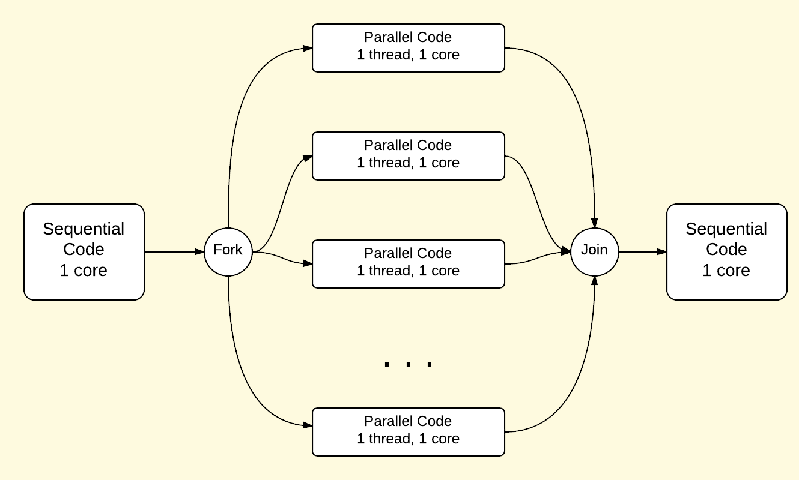

# Parallel 'patternlets'

Patternlets are minimalist, scalable, working programs that
illustrate parallel design patterns in MPI, OpenMP, Pthreads, etc.

## Explore the code examples

Each patternlet source file resides in its own folder,
which contains a Makefile to build it. The exception to this is the
mpi4py patternlets, which are executed as described in each code file.

In a Terminal, use the 'cd' command to change directory
to a given patternlet's folder; then enter 'make'
to build that patternlet.

### Follow instructions in the code file

Each patternlet's source file contains a header comment
that describes how to run that patternlet, and also
includes an 'Exercise' that describes what to do with it.

Have fun exploring the world of parallel design patterns! We will start with shared memory hardware and OpenMP software, which contain the pattern of forking* threads to create parallelism.

## Shared memory using threads as processing units

The code examples in folders inside the directory patternlets/openMP have a basic principle for creating code that runs in parallel: **forking threads**. All threaded programs start with a sequential portion, then *fork* threads to run in parallel for certain tasks, then *join* back together to form a single thread again. We can visualize this as follows:

## Origins of these examples

This code repository is a copy of a public github repo found here:

[https://github.com/joeladams/patternlets](https://github.com/joeladams/patternlets)

There is additional information about these code examples and the parallel
patterns they represent in 
[this site explaining many of them](http://selkie-macalester.org/csinparallel/modules/Patternlets/build/html/).

Contributors:
- Joel Adams, Calvin College
- Libby Shoop, Macalester College

