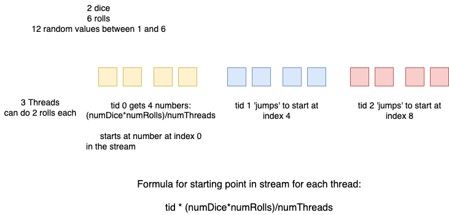

# Random number generation in parallel

Random number generation forms the basis of a class of algorithms called Monte Carlo methods. Many different computational simulations of natural phenomena in science are based on creating random values to fill in a space of possible solutions, or wait a simulated amount of time. These simulations are often very time intensive, and can benefit from parallel computing to speed up processing.

There is a catch when it comes to creating random numbers that are truly random, however, when more than one thread is trying to create random values that follow some sort of distribution.

## What is a Pseudo-Random Generator (PRNG)?

As the word ‘pseudo’ suggests, pseudo-random numbers are not random in the way you might expect, at least not if you're used to dice rolls or lottery tickets. Essentially, PRNGs are algorithms that use mathematical formulae or simply precalculated tables to produce sequences of numbers whose properties approximate the properties of sequences of random numbers. It should be noted that PRNG-generated sequences are not truly random, because it is completely determined by an initial value, called the PRNG's *seed*. However, PRNGs are still important in practice as they are *efficient*, meaning they can produce many numbers in a short time, and *deterministic*, meaning that a given sequence of numbers can be reproduced given a known starting point, called its *seed*.

### PRNGs, Monte Carlo method and Parallel Programming

PRNGs are central to Monte Carlo simulations, which create independent random potential solutions to an equation representing some phenomena. Since the solutions are generated independently, it is usually straightforward to parallelize the simulation code.  Therefore most large scale Monte Carlo simulations are run on parallel systems. The parallelization of PRNG while maintaining its quality is crucial to maintaining the quality of parallel Monte Carlo simulations.

Refer to the class slides for parallel random number generation to get a background of the ways in which a single stream of random numbers can be distributed over a set of threads or processes. In particular, study the difference between block splitting and leapfrogging methods for assigning random values to threads.

If you want to learn more detail about the different methods for creating PRNGs in parallel, chapter 1 & 2 of the TRNG library documentation is a good start. It is provided here in the file trng.pdf.

# Three separate examples, one C++ parallel PRNG library

This practice activity contains three different examples to illustrate the use of a free C++ code library called trng that provides many different methods for generating random numbers in parallel and also by sequential code.

This trng library has two main types of C++ classes: **engines** that produce the sequence of random numbers, and random number **distributions** that enable us to create values that are distributed in various ways, such uniform distributions and exponential distributions, among others. The general idea for creating a stream of values is that we create a generator, and repeatedly feed that generator to a distribution to create the next random number.

The three examples you can examine, update, and run are in these folders:

- coinFlip
- diceRolls
- histogram

These are explained in this order in the rest of this document and you should work through them in this order.

# Simulate Coin Flipping
Directory: coinFlip

Code files:

- coinFlip_seq.cpp
- coinFlip_omp.cpp

Use 'make' to build both versions. Try each with -h to see your options:

    ./coinFlip_seq -h
    ./coinFlip_omp -h

Try the sequential one with different numbers of coin flips to observe the same beginning of the stream when a constant seed is used: 

      ./coinFlip_seq -n 10 -c
      ./coinFlip_seq -n 20 -c

**NOTE:** Don't be tempted to add -v for this code- it generates prints of a lot of random numbers and was only intended for debugging with a very small number of flips.

Study this code to see what is happening here: we are running simulations of coin flipping "trials" where the number of flips in the first trial starts at 256, then is successively doubled for the next trial, stopping at the number of trials indicated by the -n argument.

Important points :

- We use the openMP timing functions in both the sequential and parallel versions for consistency in the way the times are computed.

- trng can be used to generate a random number stream with a given distribution in a sequential code as well as a parallel code.

- Here we use a chi square method to check the accuracy of our distribution of tosses. Look this up to see what value is the threshold for ensuring that the distribution is random and compare that to your results.

- With the use of -c, we start with the same 'seed' each time we run this and get the same results repeated.

## Different methods for how the stream is distributed to the threads

Now let's examine the ways in which we can assign the substreams of random numbers to each thread. There are three functions in the `coinFlip_omp.cpp` library that illustrate this:

- leapfrog1
- leapfrog2
- blocksplit

You should study each of these carefully and compare them. You could try opening this file in two panes side by side to make this easier: right-click on the `coinFlip_omp.cpp` file in the explorer on the left of VS Code and choose 'Open to the side'.

Important points:

- note the use of the pragma clause `default(none)`. This is a good practice to use because it makes you decide for certain what variables should be shared, private, or part of a reduction clause.

Try these to illustrate that the stream was the same as the sequential version and the same for 1 or multiple threads for each of the three methods:

    ./coinFlip_omp -n 10 -c -t 1
    ./coinFlip_omp -n 10 -c -t 4

Comment out 2 of the three methods called in main() for assigning the stream to the threads and keep one. Use that one of the three methods and try using different numbers of threads, like this:

    ./coinFlip_omp -n 20 -t 1 -c 
    ./coinFlip_omp -n 20 -t 2 -c 
    ./coinFlip_omp -n 20 -t 4 -c 
    ./coinFlip_omp -n 20 -t 8 -c 
    ./coinFlip_omp -n 20 -t 16 -c 

Important point:

- Convince yourself that when we use a large enough number of flips, the time to run a trial goes down by roughly half as we double the number of threads. For what values of the number of flips does this not hold? To see this, you may want to log the timing results in a different tabular form.

## Experiment yourself

Try other executions of the code- you choose.

# Simulate dice rolls
Directory: diceRolls

From the previous coinFlip folder, you can get to this example like this:

    cd ../diceRolls
    

Code file: diceSim_omp.cpp

Here is an example of a code file with openMP pragmas and a call to the trng function `jump` commented out. Without these, it can first be compiled and run as a sequential version. Try this first so you see how it works:

    make
    ./diceSim.omp -h
    ./diceSim.omp -n 5

This simulation was of 5 rolls of 2 dice.

## Test scripts

There are some linux shel scripts in this directory that are designed to test out this code with various command line inputs. If you want to learn more about shell scripts, [this tutorial](https://www.shellscript.sh/) is a good place to start. The scripts for the original sequential version can be run like this:

    bash ./testErrMsg.sh
    bash ./testDefaults.sh
    bash ./testSequential.sh

## Make it Parallel

There are three places in the code where a comment says TODO. Directly following those is either a multi-line pragma or a single call to jump or a single `#pragma omp for` line that you should uncomment. Then save and make the parallel openMP version. Note here we have one file instead of a separate sequential version file.

Try the tests in this script:

    bash ./testFixedSeed.sh

What you should notice is the following:

- The print output from each thread can seem out of order. This is natural with MIMD systems where each thread runs independently.
- If you check the rolls of the die in this fixed-seed case, the stream of random values is the same whether we used 3 threads or 4. This repeatability is what makes this trng library so useful for accurate Monte Carlo simulations.

## Examine the block splitting

This code uses the trng `jump` function to set up block splitting for the parallel version. This is done on line 82, which you should have uncommented. To see how this works, let's consider a scenario:

Two dice, six rolls, spread over 3 threads. The code splits the random number stream as follows (each thread's block of random numbers needed is a different color square):

Study the code to make certain that you see how this was done. **This is the trickiest part of using the trng library-** geting the block splitting with jump or the leapfrogging with split correct. The reason we write code with a fixed starting seed for testing is to ensure that we have done this correctly.

The above scenario pictured can be run like this:

    ./diceSim_omp -t 3 -n 6 -c -v

Notice if you run it multiple times (up arrow is your friend on the command line!) you should get the same result, but the output will be printed in different orders.

### One last note

Also note that we should only call the `jump` function in a parallel version of the code. This is why it was commented out in the given serial version. This is also true of the `split` function for leapfrogging.

----------------------------------------------------------------------

# Generate large stream of random values and place in 'bins'
Directory: histogram

From the previous diceRolls folder, you can get to this example like this:

    cd ../histogram

Code files:
- histogram_omp.cpp
- histogram_seq.cpp

In this example we will create streams of random numbers and count up how many numbers fall into smaller subranges of the original range of numbers that you specify. These subranges are often referred to as 'bins' in applications that use them. A classic example of the use of these in in image processing techniques, where the pixel rgb values can be counted in bins and the histogram plot of these values tells us something about the image. See [https://en.wikipedia.org/wiki/Color_histogram](https://en.wikipedia.org/wiki/Color_histogram) for more details and the use of the term 'bin'.

## Creating random numbers: engines and distributions

In either the sequential or the openMP version,Note in main() after the arguments are processed that there are two things needed to create a stream of random numbers:

1. An engine that gets seeded, and
2. a distribution that the numbers should fall into.
   
There are many engines and distributions that have been developed of the years, and this library contains a lot of them. They are described in detail in the trng.pdf document. Note in the code how we have included a few that you can experiment with.

## You explore this code and run it

Now that you have tried the coinFlip and diceRolls examples, you should be able to follow the sequential and parallel omp versions of this code. Practice using make and run it with different options. Pay attention to what -p does. For starters, try these, but then try other ways of running it:

    ./histogram_omp -t 4 -n 100000 -i 10 -p
    ./histogram_omp -t 4 -n 100000 -i 10 -p
    ./histogram_omp -t 4 -n 100000 -i 10 -p -c
    ./histogram_omp -t 4 -n 100000 -i 10 -p -c

Try the sequential version with these same values but without the -t option. **IMPORTANT QUESTION:** Can you spot why even with a constant seed these two codes produce different results? Study each version side by side. Ask your instructor if you are stumped.

For the parallel version, note the default number of threads and for both versions the default problem size (numbers to generate) and range of values.

## Optional practice: you choose

Try generating bin counts for a range of double values. There are some hints and commented lines in the code for this. Note for gathering the command line arguments you will want to look up and use the function strtod to convert the string on the command line to a double.

Try adding a -v option and use it to include the commented debug statements found in main() in each example code file.

Try creating some bash shell scripts like the files ending in .sh from the diceRolls example, but for this histogram code. It would be good to test out whether all of the argument gathering is correct.

