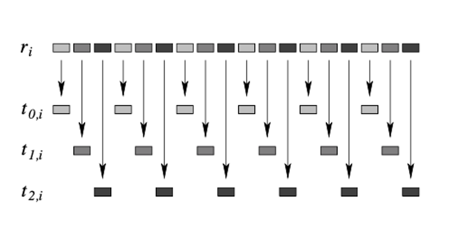
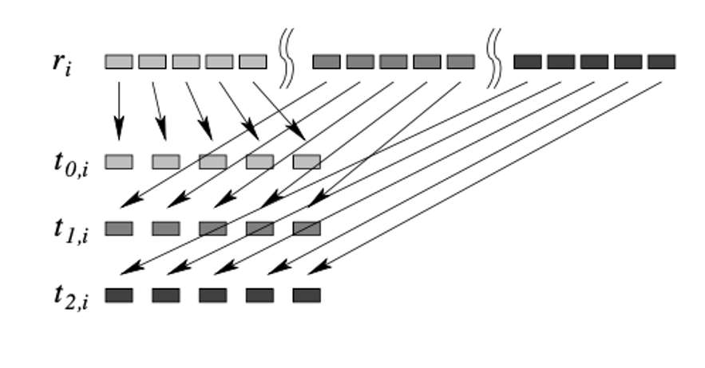

# Patterns for generating random numbers with the trng library

Random number generators are algorithms that produce a *stream* of numbers for each repeated call to a function. These generators have been implemented in libraries that are built in to a compiled language or have been developed separately. We will be examining one that has been developed separately, is open source, and is maintained regularly. It is called "Tina's Random Number Generator" or trng. For more details, you can consult [the web page for the trng library](https://www.numbercrunch.de/trng/). You can also look at the [open source for the library on gitHub](https://github.com/rabauke/trng4).

This repo contains 3 folders with small examples of the use of the trng C++ library for generating a reproducible, independent stream of random numbers. The first example is named:

- 1-sequentialLoop

This shows the use of trng in a sequential context, using single main thread and no parallelization.

Parallelization has been added in the examples inside this folder:

- 2-parallelLoops

There are two examples in subfolders named:
- 2-parallelLoops/1.equalChunks
- 2-parallelLoops/2.chunksOfOne

These illustrate the use of the data decomposition strategy pattern that uses a parallel for loop implementation strategy pattern. Other patterns are also used in these examples- we will point those out after looking at the code.

## Use of trng in a sequential program

Let's examine the code files in the `1-sequentialLoop` folder. In this case, we've placed the handling of command line arguments in 2 files directly inside this folder:

    getCommandLine.c
    getCommandLine.h

Examine the .c file to see that the arguments to the program are straightforward:

- [-n numReps] indicates the number of repetitions of the loop, each time generating a new number (default is 8).
- [-h] for help message and 
- [-c] for use of a constant seed when generating the random number stream.

The setting of a given, normally arbitrary large number as a constant seed is useful for determining that the stream of numbers generated is reproducible: when we start with a given seed value, each time the generator is used after that starting point, the *stream* of successive numbers will be the same. Thus, we should be able to call this program over and over using the -c option with the same number of loop repetitions and get the same stream of numbers.

So let's see this in the program file called `loopRepetitions.cpp`.

Here are the highlights of this program (find them in the code):

- A seed value is declared as a long unsigned int.
- We check whether the user chose the -c option and if so we set the seed to an arbitrary large integer. If not, we use the computer clock time value, which may be different each time it is run (it is the seconds since Jan.1 , 1970).
- We declare a C++ object called randGen, whose class type is one of several different generator classes available in the trng library.
- We declare the other important part of all random number generators: what type of distribution should the numbers follow? In this case we are using the uniform distribution, which in the trng library is named uniform_dist. The following syntax indicates we are calling the constructor function for the type uniform_dist in the trng library and the resulting object is named uniform:

    `trng::uniform_dist<> uniform(min, max);`

**Aside:**  the syntax `trng::uniform_dist<>` is indicating that when we call the constructor, it expects a min and max of a certain type and we are not overriding that type (and cannot). In this case, the constructor for the class is designed to take two doubles for min and max of the range of values. When we call the constructor by giving it ints, these are actually converted to doubles implicitly.

 The fine print of the documentation for trng indicates that the numbers supplied will be in a range that includes the min value, but up to and not including the max value. So in this case we will get numbers from 0.0 up to but not including 100.0 (see key point below about them getting converted to ints).

- The next point is that the generator called randGen gets seeded with the seed value.

- When given the  generator (randGen), the distribution can produce the next random value in the stream like this:

    `nextRandValue = uniform(randGen);`

**Key point here:** this repeated passing of randGen into uniform using this C++ syntax returns a number whose type becomes the type of nextRandValue, which happens to be an int in this case.

- The for loop is the way to produce a portion of the stream of random values. The variable called `repetitions` dictates how many values in the stream will be produced.

# Use of trng in parallel programs

The goal of the trng library is to be able to produce the same set of random numbers as the sequential version when given the same seed.

 The key word above is *set*. The random numbers will be the same overall for the same number of `repetitions`, but the threads will run independently and get a different portion of stream that matches the sequential version. In addition, the threads don't run in any particular order, so the stream of random numbers becomes a set with the same values as the stream.

## Two independent aspects of creating the parallel version

As with many sequential versions of programs, we can change the original version into a parallel version.  In this case with random numbers, we have two separate tasks to accomplish:

1. Use openMP pragmas and functions to fork a set of threads and use **data decomposition** with a **parallel for loop** to ensure each thread generates a roughly equal portion of the random values. We have seen two ways of implementing a parallel for loop to split the work:

    1. Break the original sequential loop into equal chunks (or off by at most one iteration of the loop). A simple version of this for reference is given in the folder 06.parallelLoop-equalChunks. It is similar, yet slightly different from the patterlet with the same name.

    2. Change the loop structure to have each thread do one of the first numThreads iterations, then skip ahead by numThreads. We're calling this "chunks of one".

2. Use the parallelism features of the trng library to ensure that each thread gets a substream of the original stream of random numbers. As mentioned above, this is actually a subset of the original stream, because the ordering is not necessarily preserved from the original stream, yet the values are. From the course slides and the trng documentation, there are two ways that the programmer can signify this separation of the random number stream onto each thread:

    1. "*Leapfrogging*": each thread gets one number from the stream, then advances by the total number of threads to get the next number. In the trng papers, this is illustrated as follows for 3 threads: 

    2. "*Block splitting*": each thread is assigned and equal succesive portion of stream. The trng documents show this as follows:
    

 Because these methods for decomposing the work (1.1 and 1.2 above) appear similar to the methods for doling out the random numbers, as a programmer you need to make sure that you don't conflate them. Instead realize that they are independent of each other.

Because these methods are **independent**, we can use either of the two data decomposition methods with either of the two methods for doling out the random numbers. Thus, there are a total of four possibilities for accomplishing the parallelization using openMP and the trng library. We provide examples of all four possibilities here.

Note that all four examples use the same command line arguments, so we reuse the code for that.

### Equal chunks data decomposition

`2-parallelLops/1.equalChunks` contains the data decomposition of the for loop into equal chunks. Within that code, the assignment of random numbers to threads is chosen from a command line argument.

Go into this above directory and make the program. Try this to see the command line arguments:

    ./loopEqualChunks -h
    ./loopEqualChunks -c      #mimics sequential version
    ./loopEqualChunks -c -t 2 -d block
    ./loopEqualChunks -c -t 2 -d leapfrog

Compare the output of the last two with that from the one that mimics the sequential version. The threads can print out data in different thread order. Follow the index values in () in the output to see which threads got which part of the loop to convince yourself that this is the equal chunks parallel for loop pattern.

Next observe that the random numbers that each thread generated are different depending on the -d option chosen for how trng will dole them out.

Now study the loopEqualChunks.cpp code to see how this was done. Of particular importance is that the loop stayed the same as the sequential version and a pragma was added to it.

 A source of confusion with the trng library is that the function called *slpit* enables the leapfrogging assignment of numbers to threads and a function called *jump* enables the block splitting.

You can also try running with 3 or 4 threads or with more random numbers using -n.

 **Careful:** what happened when you used 3 threads with block splitting and the default 8 iterations?

### Chunks of one data decomposition

The folder `2-parallelLops/2.chunksOfOne` contains the code for splitting the loop so that each thread does one of the first numThreads iterations, then skips ahead by numThreads. Observe the code file loopsChunksOfOne.cpp. In this case we changed the loop structure from the sequential version.

Notice how the choice of the trng method to dole out the random numbers is independent and coded the same in this version as the previous version.

Go into this directory and make this version.

    ./loopChunksOfOne -c     #mimics sequential
    ./loopChunksOfOne -c -t 2 -d block
    ./loopChunksOfOne -c -t 2 -d leapfrog

I this case, notice that the indices in the loop that each thread uses are not consecutive but rather follow the way it was coded.

You can also try running with 3 or 4 threads or with more random numbers using -n. 

 **Careful:** what happened when you used 3 threads with block splitting and the default 8 iterations?

# Conclusion: four different ways to accomplish the same task, but use with caution!

The bottom line with these examples is that when we have added the complexity of 2 possible ways for trng to decide which thread gets which number from the stream with two possible ways of decomposing the repetitions of a loop, we end up with four ways to achieve the same ultimate task.

Which method to use depends on the situation you are faced with. As a general rule, we often use equal chunks for decomposition because it matches the sequential version and the work being done inside the loop is roughly the same for each iteration. However, if the amount of work varies in each loop iteration, then "chunks of one" can be more effective. We have to combine it with a mechanism for letting more threads do more iterations if they are ready for work. This is called dynamic thread assignment.

When it comes to doling out the random numbers to the threads, the choice is somewhat important. Block splitting makes sense when the iterations can be equally divided by the treads (what happened when you chose 3 threads?). Leapfrog works even if each thread does not do exactly the same number of iterations of the loop. This is often the case, so most of the time the leapfrog method becomes the proper choice.
