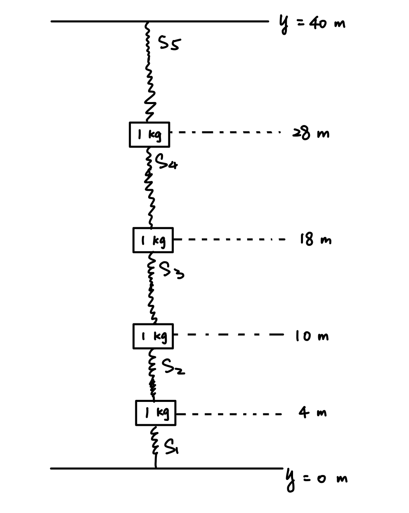

```{r setup, include=FALSE}
knitr::opts_chunk$set(echo = TRUE)
```


\[0 = -gm_{1} + k(L-(y_{1}-0)) - k(L-(y_{2}-y_{1}))\]
\[0 = -gm_{2} + k(L-(y_{2}-y_{1})) - k(L-(y_{3}-y_{2}))\]
\[0 = -gm_{3} + k(L-(y_{3}-y_{2})) - k(L-(y_{4}-y_{3}))\]
\[0 = -gm_{4} + k(L-(y_{4}-y_{3})) - k(L-(H-y_{4}))\]2
\[\begin{pmatrix} -2k&k&0&0\\k&-2k&k&0 \\0&k&-2k&k \\ 0&0&k&-2k\end{pmatrix} \begin{pmatrix}y_{1}\\y_{2}\\y_{3}\\y_{4}\end{pmatrix} = \begin{pmatrix}gm_{1}\\gm_{2}\\gm_{3}\\gm_{4}-kH\end{pmatrix}\]
k = 5 N/m
g = 10 m/s^{2}
m1 = m2 = m3 = 1kg
H = 2m

```{r}
# initialize variables 
k <- 5
g <- 10
m1 <- 1
m2 <- 1
m3 <- 1
m4 <- 1
H <- 40
```

```{r}
A <- cbind(c(-2*k, k, 0, 0), c(k, -2*k, k, 0), c(0, k, -2*k, k), c(0, 0, k, -2*k))
b <- c(g*m1, g*m2, g*m3, g*m4-k*H)
A
b
```

```{r}
x <- qr.solve(A,b)
x
```


