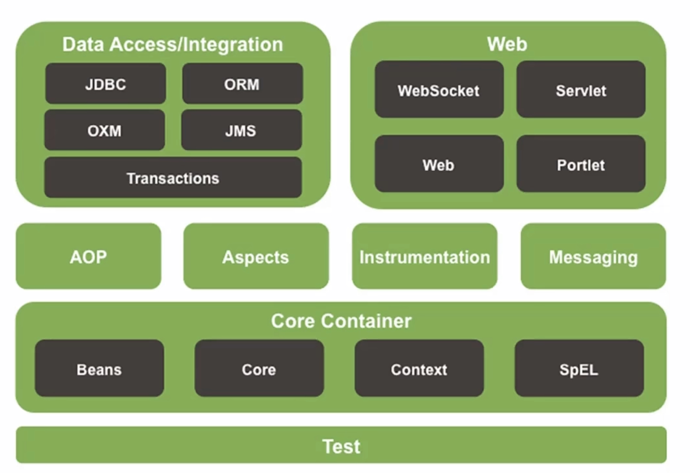

Spring Framework 系统架构

- Spring Framework是生态圈中最基础的项目，是其他项目的根基
- Core Container: 核心容器 -> 装对象
- AOP：面向切面编程（Aspects为AOP思想呈现）
- Data Access / Integration : 数据访问，数据集成
- Web： Web开发
- Test: 单元测试和集成测试

Spring Framework 学习路线

- 核心容器 Ioc/DI
- 整合 MyBatis
- AOP
- 事务